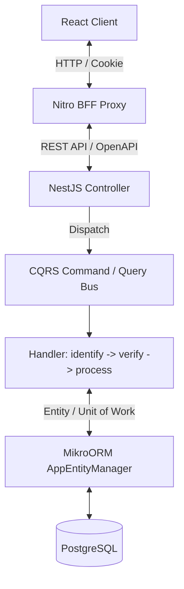
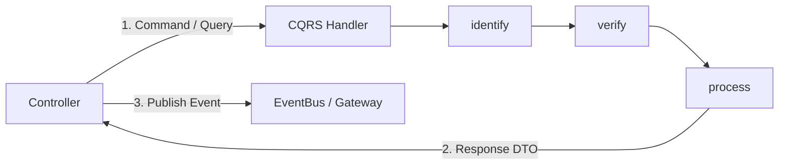
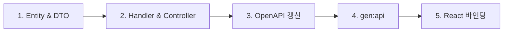

# 풀스택 아키텍처 및 개발 표준

모노레포(NestJS, React, BFF)의 계층 구조, CQRS 파이프라인, DTO 규약 및 데이터 영속성 구조.

---

## 1. 아키텍처 계층



| 계층 | 역할 및 구성 |
| :--- | :--- |
| **Controller** | 요청 검증 및 CQRS Bus 디스패치, 이벤트 발행(`EventBus`) 및 소켓 브로드캐스트 조율 |
| **CQRS Handler** | 유스케이스 실행 (`identify -> verify -> process` 3단계), 순수 도메인 처리 및 Response DTO 반환 |
| **Entity / DB** | BaseEntity 상속, ULID PK, 물리적 유니크/외래키 제약조건 정의 |
| **BFF & Client** | Orval 자동 생성 코드 기반 연동 |

---

## 2. CQRS 핸들러 라이프사이클 및 이벤트 조율



1. **`identify*` (식별)**: 대상 엔티티 조회
2. **`verify*` (검증)**: 엔티티 도메인 상태 검증
3. **`process` (처리)**: 상태 변경 / 생성 후 전용 Response DTO 인스턴스 반환
4. **이벤트 조율 (Controller / Handler)**: 실행 결과(Response DTO)를 바탕으로 `EventPublisher.publish()` (`src/infra/event-publisher`)를 통해 이벤트 발행 및 소켓/외부 브로커 연동 조율
5. **CQRS 페이로드 및 타입 추론**:
   - `Command<TResponse>`, `Query<TResponse>`에 반환 타입을 지정하여 `commandBus.execute()`, `queryBus.execute()` 자동 타입 추론 활용
   - 단일 Request DTO 또는 복합 인자(Path Param, Context 등) 전달 시 `*Payload` 인터페이스와 `constructor(public readonly input: *Payload)`를 사용하여 객체 형태로 일관되게 전달

---

## 3. Platform Event Publisher Architecture

`src/infra/event-publisher/` 내의 글로벌 동적 모듈로, 다중 채널(InMemory CQRS EventBus, Kafka, 외부 브로커 등)에 이벤트를 브로드캐스트한다.

### 3.1 디렉터리 구조

```text
src/infra/event-publisher/
├── event-publisher.interface.ts   # Core DTOs & SPI Contract
├── event-publisher.service.ts     # Multi-channel Orchestrator Service
├── event-publisher.module.ts      # Dynamic Module
├── channels/
│   ├── in-memory/                 # CQRS EventBus Adapter
│   ├── redis/                     # Redis Pub/Sub (options: { url, topic })
│   ├── kafka/                     # Kafka Producer Stub
│   └── rabbitmq/                  # RabbitMQ Exchange Stub
└── index.ts
```

### 3.2 사용 규칙

1. **단일 주입점**: 모든 이벤트 발행은 `EventPublisher` 서비스 1개만을 DI 받아 실행한다.
2. **비동기 안전성**: `publish()`는 `Promise<void>`를 반환하며 `await`로 안전하게 완료를 대기하거나 백그라운드로 실행할 수 있다.
3. **이벤트 핸들러 연계**: `@EventsHandler(EventClass)` 데코레이터를 가진 CQRS 핸들러들은 `inMemory: true` 채널을 통해 즉각 실행된다.

```typescript
import { EventPublisher } from '#/infra/event-publisher';
```

### 3.2 등록 방법

`app.module.ts`에서 `EventPublisherModule.forRoot()`를 한 번만 호출한다. 모듈은 `@Global()`로 선언되어 있으므로 별도 import 없이 전역 사용 가능.

```typescript
// app.module.ts
@Module({
  imports: [
    // 1) 기본 인메모리 채널 활성화
    EventPublisherModule.forRoot({
      inMemory: true,
    }),

    // 2) Redis / Kafka / RabbitMQ 브로커 추가 활성화 시
    // EventPublisherModule.forRoot({
    //   inMemory: true,
    //   redis: { url: 'redis://localhost:6379', topic: 'events' },
    //   kafka: { brokers: ['localhost:9092'], topic: 'app-events' },
    //   rabbitmq: { url: 'amqp://localhost:5672', exchange: 'events' },
    // }),
  ],
})
export class AppModule {}
```

### 3.3 이벤트 발행 패턴

Controller 또는 Handler의 생성자에 `EventPublisher`를 주입하여 사용한다.

```typescript
import { EventPublisher } from '#/common/services/event-publisher';

@Controller('notices')
export class NoticesController {
  constructor(
    private readonly commandBus: CommandBus,
    private readonly eventPublisher: EventPublisher,
  ) {}

  @Post()
  async create(@Body() dto: CreateNoticeRequestDto) {
    const result = await this.commandBus.execute(
      new CreateNoticeCommand({ ...dto }),
    );
    await this.eventPublisher.publish(new NoticeCreatedEvent(result));
    return result;
  }
}
```

### 3.4 새 채널 추가

`IEventChannel` 인터페이스를 구현하고 `EVENT_CHANNELS` 멀티프로바이더에 등록한다.

```typescript
// kafka-event.channel.ts
@Injectable()
export class KafkaEventChannel implements IEventChannel {
  async publish(event: IAppEvent): Promise<void> {
    // Kafka producer 연동
  }
}

// event-publisher.module.ts forRoot() providers에 추가
{
  provide: EVENT_CHANNELS,
  useFactory: (inMemory: InMemoryEventChannel, kafka: KafkaEventChannel) =>
    [inMemory, kafka],
  inject: [InMemoryEventChannel, KafkaEventChannel],
}
```

---

## 4. DTO 및 데이터 규약

엔드포인트별 **`RequestDto ↔ ResponseDto` 1:1 페어** 구성.

### 4.1 DTO 분류 및 작성 구조

- **Request DTO (`*.request.dto.ts`)**:
  - 클라이언트 입력 검증 및 CQRS 입력 페이로드.
  - `DtoType(Entity)`를 상속받아 클래스 필드와 데코레이터를 기술.
  - 요청 필드가 없거나 식별자(`id`)만 있는 경우에도 대상 Entity 연결을 위해 `DtoType(Entity)` 상속.

    ```typescript
    // 1) 생성 (Create) - 필수 필드 및 검증 정의
    export class CreateNoticeRequestDto extends DtoType(Notice) {
      @ApiProperty({ type: 'string', maxLength: 255 })
      @IsString()
      @IsNotEmpty()
      @MaxLength(255)
      override title!: string;

      @ApiProperty({ type: 'string' })
      @IsString()
      @IsNotEmpty()
      override content!: string;
    }

    // 2) 수정 (Update) - 옵셔널 필드 및 검증 정의
    export class UpdateNoticeRequestDto extends DtoType(Notice) {
      @ApiPropertyOptional({ type: 'string', maxLength: 255 })
      @IsOptional()
      @IsString()
      @MaxLength(255)
      override title?: string;

      @ApiPropertyOptional({ type: 'string' })
      @IsOptional()
      @IsString()
      override content?: string;
    }

    // 3) 식별자(Path Param)
    export class DeleteNoticeRequestDto extends DtoType(Notice) {
      @ApiProperty({ type: 'string' })
      @IsString()
      override id!: string;
    }

    // 4) 요청 필드가 없는 경우
    export class GetNoticesRequestDto extends DtoType(Notice) {}
    ```

- **Response DTO (`*.response.dto.ts`)**:
  - 클라이언트 반환용 최종 응답 포맷.
  - 전용 Response DTO 인스턴스를 반환.
- **Item DTO (`*-item.dto.ts`)**: 단건 및 페이징/목록에서 재사용되는 엔티티 투영 DTO (`DtoType(Entity)` 상속).
- **내부 페이로드 (`*Payload`)**: OAuth 콜백, 컨텍스트 결합(`userId`, `deletedBy`) 등 클라이언트 HTTP DTO와 분리된 내부 전달 데이터는 해당 Command/Query 파일 내 `interface`로 정의.

### 4.2 페이징 / 목록 표준 DTO

- **오프셋 페이징**: `PageRequestDto<Entity, SortKey>` 상속 / `PageResponseDto<ItemDto>` 활용
- **커서 페이징**: `CursorRequestDto<Entity, SortKey>` 상속 / `CursorResponseDto<ItemDto>` 활용
- **전체 목록 조회**: `ListRequestDto` / `ListResponseDto<ItemDto>` 활용

---

## 5. 데이터 영속성 (MikroORM)

1. **BaseEntity**: 모든 엔티티는 `BaseEntity`를 상속하여 ULID PK 및 감사 컬럼(`createdAt`, `updatedAt`, `deletedAt`, `deletedBy`) 보유.
2. **Soft Delete**: `deletedAt IS NULL` 전역 필터 적용 (필요 시 `{ filters: false }` 우회).
3. **Unit of Work**: `UnitOfWorkInterceptor`를 통한 HTTP 요청 완료 시 자동 커밋.
4. **비동기 이벤트 핸들러 영속성**: HTTP 생명주기 외 비동기 `EventsHandler`는 `await this.em.runInContext(async (em) => { ... })`를 사용하여 Fork & Auto-Flush 컨텍스트 내에서 실행.
5. **페이징**: `em.findByPage()`, `em.findByCursor()`를 사용하여 페이징 결과 일괄 반환.

---

## 6. 보안 및 컨텍스트 파이프라인

1. **가드 체인**: `AuthGuard` (인증) $\rightarrow$ `PermissionGuard` (권한) $\rightarrow$ `TermsAgreementGuard` (약관).
2. **컨텍스트**:
   - HTTP 사용자: `@CurrentUser()` 파라미터 데코레이터 주입
   - 프레임워크 컨텍스트: `RequestContext` (CLS 기반)

---

## 7. Schema-Driven SSOT 개발 워크플로우



1. **Entity & DTO 정의**: Entity 작성 $\rightarrow$ `DtoType` 기반 1:1 Request/Response DTO 정의
2. **CQRS 구현**: Command/Query 및 `identify -> verify -> process` 핸들러 구현 (Response DTO 반환)
3. **Controller 노출**: Swagger 데코레이터(`@SwaggerApiResponse`) 및 권한 선언, 부수효과(이벤트/소켓) 조율
4. **클라이언트 코드 생성**: `pnpm --filter react-starter-kit gen:api` 실행 (React Query 훅 및 Zod 스키마 자동 생성)
5. **UI 연동**: 자동 생성된 훅을 사용하여 UI 컴포넌트 연결

---

## 8. 프론트엔드 라우팅 및 쿼리 파라미터 (TanStack Router)

1. **검색 파라미터 검증 (`validateSearch`)**:
   - TanStack Router의 `validateSearch`에 `z.object({...})` 객체를 직접 인라인으로 전달.
   - Standard Schema 규약에 따라 타입 추론과 검증이 자동 처리됨.

   ```tsx
   export const Route = createFileRoute('/_protected/_app/notice/')(({
     validateSearch: z.object({
       noticeId: z.string().optional(),
     }),
     component: AnnouncementsPageComponent,
   });
   ```

2. **모달 닫기 시 URL 쿼리 정리**:
   - 모달을 닫을 때는 `navigate({ search: (prev) => { ... }, replace: true })`로 URL 파라미터를 정리하여 히스토리 관리.

---

## 9. 코드 스타일

- **본질 명사 중심**: 변수/메서드명에 직관적인 명사 사용.
- **생성자 주입**: TypeScript 매개변수 속성 기반 생성자 주입.
- **단일 책임**: 핸들러당 1개 유스케이스 및 `process` 단계에서 응답 구성 완결.
