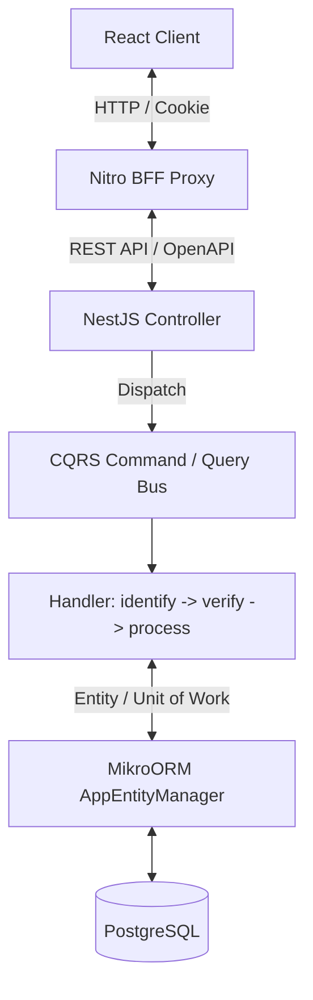
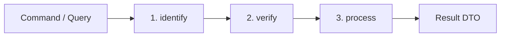
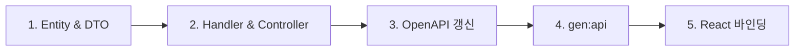

# 풀스택 아키텍처 및 개발 표준

모노레포 전반(NestJS, React, BFF)에서 신규 기능 개발 및 유지보수 시 준수할 공통 아키텍처 규칙.

---

## 1. 아키텍처 계층

| 계층 | 핵심 규칙 |
| :--- | :--- |
| **Controller** | 비즈니스 로직 작성 금지, 요청 검증 및 CQRS Bus 디스패처 역할만 수행 |
| **CQRS Handler** | 유스케이스 실행 담당 (`identify -> verify -> process` 3단계 준수) |
| **Entity / DB** | BaseEntity 상속, ULID PK, 물리적 유니크/외래키 제약조건 보장 |
| **BFF & Client** | Orval 자동 생성 코드 기반 SSOT(Single Source of Truth) 연동 |

---

## 2. CQRS 핸들러 라이프사이클

1. **`identify*` (식별)**: 대상 엔티티 조회 (없으면 `NOT_FOUND` 예외, 생성 유스케이스는 생략).
2. **`verify*` (검증)**: 엔티티의 도메인 상태 검증 (위배 시 `ApplicationError` 예외, 규칙 없으면 생략).
3. **`process` (처리)**: 상태 변경, 생성, 이벤트 발행 및 최종 결과 DTO 반환.

---

## 3. DTO 및 데이터 규약

DTO는 빈 객체라도 항상 `RequestDto ↔ ResponseDto` 1:1 페어로 관리함.

- **Request DTO (`*.request.dto.ts`)**: 클라이언트 입력 검증 및 핸들러 입력 페이로드 (`DtoType(Entity)` 상속)
- **Response DTO (`*.response.dto.ts`)**: 클라이언트 반환용 최종 응답 포맷
- **Item DTO (`*-item.dto.ts`)**: 단건 및 페이징 목록에서 재사용되는 엔티티 투영 DTO (`DtoType(Entity)` 상속)
- **내부 타입 (`*Payload` / `*Result`)**: DTO 파일로 분리할 필요 없는 내부 전용 데이터는 해당 Command/Query 파일 내에 `interface`로 정의
- **페이징 규약**:
  - 오프셋 페이징: `PageRequestDto<Entity, SortKey>` 상속
  - 커서 페이징: `CursorRequestDto<Entity, SortKey>` 상속
  - 검색: `SearchableRequestDto` 상속

---

## 4. 데이터 영속성 규약 (MikroORM)

1. **BaseEntity**: 모든 엔티티는 `BaseEntity`를 상속하여 ULID PK 및 감사 컬럼(`createdAt`, `updatedAt`, `deletedAt`, `deletedBy`) 보유.
2. **Soft Delete**: `deletedAt IS NULL` 전역 필터 적용 (필요 시 `{ filters: false }` 우회).
3. **Unit of Work**: 핸들러 내 `em.flush()` 직접 호출 금지 (`UnitOfWorkInterceptor`가 자동 커밋).
4. **페이징**: `em.findByPage()`를 사용하여 페이징 결과 일괄 반환.

---

## 5. 보안 및 컨텍스트 파이프라인

1. **가드 체인**: `AuthGuard` (인증) $\rightarrow$ `PermissionGuard` (권한) $\rightarrow$ `TermsAgreementGuard` (약관).
2. **컨텍스트**:
   - HTTP 사용자: `@CurrentUser()` 파라미터 데코레이터 주입
   - 프레임워크 컨텍스트: `RequestContext` (CLS 기반)

---

## 6. Schema-Driven SSOT 개발 워크플로우

1. **Entity & DTO 정의**: Entity 작성 $\rightarrow$ `DtoType` 기반 Request/Response DTO 정의
2. **CQRS 구현**: Command/Query 및 `identify -> verify -> process` 핸들러 구현
3. **Controller 노출**: Swagger 데코레이터(`@SwaggerApiResponse`) 및 권한 선언
4. **클라이언트 코드 생성**: `pnpm --filter react-starter-kit gen:api` 실행 (React Query 훅 및 Zod 스키마 자동 생성)
5. **UI 연동**: 자동 생성된 훅을 사용하여 UI 컴포넌트 연결

---

## 7. 클린 코드 원칙

- **본질 명사 사용**: 변수/메서드명에 불필요한 기계적 접미사/접두사 배제.
- **생성자 주입**: `@Inject()` 대신 TypeScript 표준 매개변수 속성 주입 사용.
- **단일 책임**: 핸들러는 1개 유스케이스만 전담하며, 응답 조립은 `process`에서 완결.
