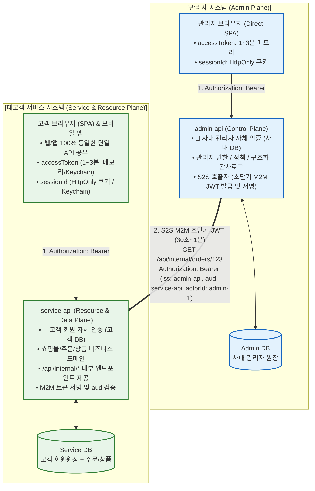
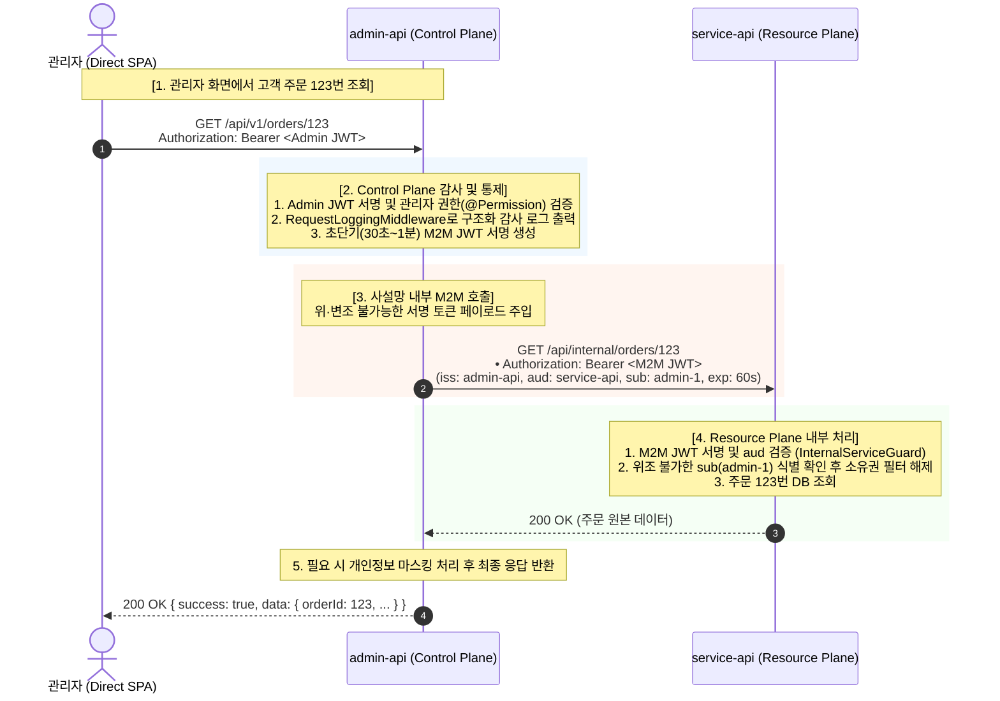

# 인증 격리 아키텍처 및 통신 명세서 (Direct SPA & M2M Token)

본 문서는 **1) 도메인별 분산 독립 인증**, **2) Control Plane 경유 방식의 서비스 데이터 열람(/api/internal/*)**, **3) 초단기 M2M 서명 토큰 기반 S2S 통신**, 그리고 **4) 하이브리드(Session + 초단기 JWT) 클라이언트 인증 흐름**을 시각화하여 기술합니다.

---

## 1. 전체 시스템 아키텍처 다이어그램 (4개 체제)

중앙 `auth-service` 없이 관리자 시스템과 대고객 서비스 시스템이 물리적으로 완전 분리되어 동작합니다.



---

## 2. 관리자의 서비스 리소스 접근 흐름 (Control Plane 경유 S2S M2M)

관리자 화면은 `service-api`의 내부 주소를 전혀 알 필요가 없으며, 모든 요청은 **`admin-api`를 단일 진입점**으로 통과합니다.



---

## 3. 하이브리드 인증 라이프사이클 (Session + 초단기 JWT)

클라이언트는 1~3분 초단기 AccessToken(메모리)으로 고속 API를 호출하며, 만료 시 Redis의 세션 상태(sessionId)를 기반으로 토큰을 갱신합니다. 1회용 회전 티켓이 아닌 상태 기반 세션이므로 동시 다발적 401 갱신 시에도 충돌 없이 안전합니다.

```mermaid
sequenceDiagram
    autonumber
    actor User as 사용자 (React SPA / Mobile)
    participant Client as API 클라이언트 (Axios / Fetch)
    participant API as 백엔드 API (admin-api / service-api)
    participant Redis as 세션 저장소 (Redis)

    %% 1. 로그인
    Note over User, Redis: [1. 로그인 시점]
    User->>API: POST /api/v1/auth/login (ID/PW 또는 사내SSO/소셜)
    API->>Redis: SET session:sess_123 { userId, device, lastActiveAt } (TTL: 7일)
    API-->>User: 200 OK<br/>• Body: { accessToken: "eyJ...", expiresIn: 180 }<br/>• Set-Cookie: sessionId="sess_123"; HttpOnly; Secure; Path=/api/v1/auth
    Note over Client: accessToken을 메모리 변수에 보관 (웹: 메모리, 모바일: 메모리/Keychain)

    %% 2. 무상태 API 호출
    Note over User, API: [2. 일상적인 API 호출 (1~3분 무상태)]
    Client->>API: GET /api/v1/me (Authorization: Bearer <accessToken>)
    Note over API: Redis/DB 조회 없이 CPU에서 서명만 검증 (<1ms)
    API-->>Client: 200 OK

    %% 3. 토큰 만료 시 세션 기반 갱신
    Note over User, Redis: [3. 토큰 만료 시 세션 기반 갱신]
    Client->>API: GET /api/v1/me (만료된 토큰)
    API-->>Client: 401 Unauthorized
    Note over Client: 401 수신 시 갱신 대기열 락(Lock) 활성화 후 1회 갱신 요청
    Client->>API: POST /api/v1/auth/token (쿠키 또는 헤더의 sessionId 전달)
    API->>Redis: GET session:sess_123 (원격 로그아웃/차단 여부 확인)
    Redis-->>API: 세션 유효 (Active)
    API->>Redis: EXPIRE session:sess_123 604800 (세션 슬라이딩 연장)
    API-->>Client: 200 OK { accessToken: "new_token", expiresIn: 180 }
    Note over Client: 새 토큰으로 대기 중인 원본 요청 재시도

    %% 4. 원격 강제 로그아웃
    Note over User, Redis: [4. 즉시 차단 및 원격 로그아웃 (Instant Revocation)]
    User->>API: POST /api/v1/auth/logout (또는 관리자의 계정 정지)
    API->>Redis: DEL session:sess_123
    Note over Redis: 세션 즉시 삭제! 최대 1~3분 내 토큰 만료 시 영구 차단
```

---

## 4. 최종 결정 아키텍처 요약표

| 구분 | 최종 결정 내용 |
| :--- | :--- |
| **인증 원장 구조** | **도메인별 분산**: `auth-service` 제거 ➔ `admin-api` & `service-api` 각자 독립 인증 원장 |
| **서비스 데이터 열람** | **Control Plane 경유**: `admin-api` 감사로그 영구 기록 ➔ `service-api`의 `/api/internal/*` 라우팅 |
| **S2S 통신 인증** | **초단기 M2M 서명 토큰 (JWT)**: `admin-api`가 서명 발급 (`iss: admin-api`, `aud: service-api`, TTL 30초~1분), 위·변조 방지 |
| **클라이언트 인증** | **하이브리드 (Session + 초단기 JWT)**: 1~3분 메모리 `accessToken` + Redis 상태 기반 `sessionId` (웹: HttpOnly, 모바일: Keychain) |
| **동시성 및 안정성** | **동시 401 충돌 방지**: 1회용 회전 티켓이 아닌 세션 상태 객체 검증 방식이므로 지하철/엘리베이터 재접속 및 다중 요청 충돌 없음 |
| **모바일 앱 연동** | **동일 REST 규격 공유**: 웹과 모바일 앱(Capacitor/Native)이 100% 동일한 REST 엔드포인트 공유 |
| **보류 항목** | 사용자 리소스 데이터(Auth vs Resource) 엔티티의 세부 테이블 배치는 후속 기획에 종속 |
