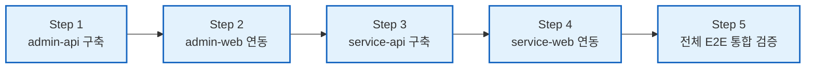

# Control Plane / Data Plane 분리 계획 (하이브리드 인증 & S2S 아키텍처)

## 1. 아키텍처 목표 및 핵심 결정 사항

본 아키텍처는 중앙 집중식 인증 서버(`auth-service`)의 병목과 단일 장애점(SPOF)을 제거하고, 사내 운영망과 대고객 서비스망을 완벽하게 물리적 격리하는 것을 목표로 한다.
웹과 모바일 환경 모두에서 강력한 실시간 세션 통제권(원격 로그아웃, 동시 접속 제한)과 고성능 무상태 처리를 동시에 달성하기 위해 **하이브리드(Session + 초단기 JWT) 인증 모델**을 채택한다.

---

### 최종 확정된 5대 핵심 의사결정

1. **도메인별 분산 인증 (Decentralized Auth)**:
   - 중앙 `auth-service`를 완전히 제거하고, `admin-api`(사내 관리자)와 `service-api`(고객 회원)가 각자의 인증 원장 DB를 독립 소유한다.
   - 사내 관리자 계정과 대고객 회원 계정은 물리적으로 완전히 다른 데이터베이스에서 보관된다.
2. **Control Plane 경유 데이터 열람 (`/api/internal/*`)**:
   - 관리자 화면은 오직 `admin-api`만 호출한다 (단일 진입점).
   - 관리자의 모든 고객/서비스 데이터 조작은 `admin-api`에서 법적 필수 감사 로그(Audit Log)를 영구 기록한 후, `service-api`의 `/api/internal/*` 라우팅을 호출한다.
3. **초단기 M2M 서명 토큰 기반 S2S 통신 (JWT)**:
   - 정적 API Key 대신 `admin-api`가 호출 시점에 **30초~1분 초단기 M2M JWT**를 서명 발급하여 `Authorization: Bearer <M2M_TOKEN>` 헤더로 전송한다.
   - 페이로드(`iss: 'admin-api'`, `aud: 'service-api'`, `sub: admin.id`, `requestId`)가 전자 서명되어 위·변조가 원천 불가하며, 유출되더라도 1분 뒤 자동 무효화된다.
4. **하이브리드(Session + 초단기 JWT) 클라이언트 인증 모델**:
   - **세션(SessionId)**: Redis에 저장되는 실시간 상태 객체로, 기기 식별, 즉각적인 원격 로그아웃, 동시 접속 수 제어, 슬라이딩 연장을 담당한다. (웹: HttpOnly 쿠키, 모바일: Keychain/EncryptedSharedPreferences 저장)
   - **토큰(AccessToken)**: 백엔드 API를 찌를 때 사용하는 1~3분 초단기 무상태(Stateless) JWT로, 메모리에만 보관하여 고속 통신을 지원한다.
   - **동시 요청 안전성**: 1회용 티켓(RTR)이 아니므로 프론트엔드/모바일의 동시 401 갱신 요청이나 지하철/엘리베이터 재시도 시에도 토큰 충돌로 인한 강제 튕김이 발생하지 않는다.
5. **웹과 모바일 앱의 100% 동일한 REST API 공유**:
   - 향후 모바일 앱(Capacitor/Native) 도입 시 별도 모바일 전용 엔드포인트를 두지 않고, 웹과 동일한 REST API 규격을 그대로 공유한다.

---

## 2. 최종 실행 프로젝트 구성 (4개 체제)

| 프로젝트 | 계층 | 기술 스택 및 역할 |
| :--- | :--- | :--- |
| **`admin-web`** | 관리자 화면 | TanStack Router + React (메모리 AccessToken + HttpOnly SessionId 쿠키) |
| **`service-web`** | 서비스 화면 | TanStack Router + React (웹/모바일 단일 REST 규격 사용) |
| **`admin-api`** | Control Plane | NestJS: 사내 관리자 자체 인증(임직원 DB/SSO/OTP), 감사 로그, S2S 호출자 |
| **`service-api`** | Data Plane & Resource | NestJS: 대고객 회원 자체 인증(고객 DB/소셜가입), 비즈니스 도메인, `/api/internal/*` 제공 |

```text
[관리자 시스템 (Admin Plane)]                  [대고객 서비스 시스템 (Service Plane)]
Admin Browser (React)                         User Browser & Mobile App
  • accessToken (1~3분, 메모리)                 • accessToken (1~3분, 메모리/Keychain)
  • sessionId (HttpOnly 쿠키)                   • sessionId (HttpOnly 쿠키 / Keychain)
           │                                             │
           ├─ Authorization: Bearer <accessToken>        ├─ Authorization: Bearer <accessToken>
           ▼                                             ▼
admin-api (Control Plane)                     service-api (Data Plane / Resource)
  • 🔐 사내 관리자 자체 인증 (사내 DB)          • 🔐 대고객 회원 자체 인증 (고객 DB)
  • 세션 상태 관리 (Admin Redis)                • 세션 상태 관리 (Service Redis)
  • RequestLogging 감사 로그 방출               • 웹/모바일 단일 API 서빙 (주문/상품/결제)
  • S2S 호출자 (초단기 M2M JWT 발급)             • /api/internal/* 내부 엔드포인트 제공
           │                                             ▲
           └────── S2S M2M 호출 (Bearer <M2M_JWT>) ──────┘
                   GET /api/internal/orders/:id
                   (iss: admin-api, aud: service-api, sub: admin-1)
```

---

## 3. 하이브리드 인증 라이프사이클 흐름

### 3.1. 로그인 및 세션 생성
1. 사용자가 ID/PW(또는 사내 SSO / 고객 소셜)로 `/api/v1/auth/login`을 호출한다.
2. 백엔드는 자격 증명을 검증하고 Redis에 세션(`sessionId`) 객체를 생성한다:
   ```json
   {
     "sessionId": "sess_abc123",
     "userId": "user-1",
     "device": "MacBook / iPhone",
     "role": "ADMIN",
     "lastActiveAt": 1789649500
   }
   ```
3. 백엔드는 **초단기 AccessToken(1~3분)**을 발급한다:
   - **Response Body**: `{ accessToken: "eyJ...", expiresIn: 180 }` (모바일/웹 공통 수신)
   - **Set-Cookie**: `sessionId="sess_abc123"; HttpOnly; Secure; SameSite=Lax; Path=/api/v1/auth` (웹 브라우저용)
   - **Response Body (모바일 전용 헤더 요청 시)**: `{ sessionId: "sess_abc123" }` (모바일 OS Keychain 보관용)

### 3.2. 일상적인 고속 API 호출 (무상태)
- 클라이언트는 1~3분 동안 메모리의 `accessToken`을 `Authorization: Bearer` 헤더에 실어 호출한다.
- 백엔드는 Redis나 DB를 조회하지 않고 CPU 메모리에서 JWT 서명만 검증(1ms 미만)하여 고속 응답한다.

### 3.3. 토큰 만료 시 세션 기반 갱신 (`/api/v1/auth/token`)
1. 1~3분 후 `accessToken`이 만료되면 백엔드가 `401 Unauthorized`를 반환한다.
2. 클라이언트는 `/api/v1/auth/token`을 호출한다 (웹은 쿠키의 `sessionId`, 모바일은 Body의 `sessionId` 전달).
3. 백엔드는 **Redis의 세션 상태**를 확인한다:
   - *"이 세션이 원격 로그아웃되었는가?"*
   - *"비밀번호 변경이나 권한 박탈로 세션이 파기되었는가?"*
4. 세션이 유효하면 즉시 새 초단기 `accessToken`을 찍어 반환하고, Redis 세션의 TTL을 자동 연장(Sliding Session)한다.
5. 동시 다발적 401 요청이 들어와도 세션 ID는 1회용 티켓이 아니므로 **토큰 충돌이나 강제 로그아웃 튕김이 발생하지 않는다.**

### 3.4. 원격 강제 로그아웃 (Instant Revocation)
- 사용자가 "다른 기기에서 로그아웃"을 누르거나 관리자가 계정을 정지시키면, Redis에서 해당 세션 키만 즉시 `DEL`한다.
- 최대 1~3분 내에 해당 기기의 토큰이 만료되고, 갱신 시 세션 부재로 **시스템 전체에서 즉각 차단**된다.

---

## 4. 관리자의 서비스 리소스 접근 및 양방향 S2S M2M 통신

### 4.1. 관리자의 서비스 데이터 열람 (`admin-api` ➔ `service-api`)
1. **관리자 요청**: 브라우저 ➔ `admin-api` (`GET /api/v1/orders/123`, `Authorization: Bearer <Admin JWT>`)
2. **Control Plane 감사 및 인가**:
   - `admin-api`가 관리자 권한을 검증하고 `RequestLoggingMiddleware`로 감사 로그를 출력한다.
   - 대상 목적지(`aud: 'service-api'`)를 명시한 **초단기(30초~1분) M2M JWT**를 새로 서명 생성한다.
3. **S2S 내부 위임 호출**:
   - `admin-api`가 사설망(VPC)을 통해 `service-api`의 내부 엔드포인트를 호출한다:
     ```http
     GET /api/internal/orders/123 HTTP/1.1
     Host: service-api.internal
     Authorization: Bearer <M2M_JWT>
     ```
     - 페이로드: `{ "iss": "admin-api", "aud": "service-api", "sub": "admin-1", "requestId": "req-xyz", "exp": 1789649560 }`
4. **Data Plane 내부 처리**:
   - `service-api`는 `InternalServiceGuard`로 M2M JWT 서명 및 `aud: 'service-api'`를 검증한 후, 고객 소유권 필터 없이 주문 DB를 조회하여 반환한다.
5. **마스킹 및 최종 반환**:
   - `admin-api`는 필요 시 개인정보(주민번호/계좌번호)를 마스킹하여 관리자 화면에 반환한다.

### 4.2. 역방향 운영 설정 조회 (`service-api` ➔ `admin-api`)
- `service-api`가 기동 시 또는 설정 갱신 시 `admin-api`에 `SystemConfig`를 요청할 때:
  - `service-api`가 **자신이 발급자(`iss: 'service-api'`)**가 되어 수신자(`aud: 'admin-api'`)로 서명된 새 M2M JWT를 발급하여 호출 (`GET /api/internal/system-configs`).
  - `admin-api`는 `InternalServiceGuard`로 `aud: 'admin-api'`를 검증하여 설정 데이터 응답.

### 4.3. 다중 홉(Multi-Hop) 인증 전파 원칙 (패턴 1 준용)
- 서비스 간 호출이 2개 이상의 홉(A ➔ B ➔ C)으로 이어질 경우, 이전 홉에서 받은 토큰을 그대로 전달(토스)하지 않고 **각 서버가 다음 목적지(`aud`)를 향해 신규 M2M JWT를 즉시 서명 발급**합니다.
- 최초 요청자 식별자(`actorId`)와 `requestId`는 페이로드에 계속 보존되어 전파되므로, **`aud` 불일치 및 네트워크 지연에 따른 30초 만료 오류가 원천 방지**됩니다.

---

## 5. 저장소 및 물리적 격리 기준

| 항목 | 관리 위치 | 목적 |
| :--- | :--- | :--- |
| **`accessToken`** | 브라우저 메모리 / 앱 Keychain | 1~3분 초단기 무상태 API 호출 |
| **`sessionId`** | 브라우저 HttpOnly 쿠키 / 앱 Keychain | 세션 상태 식별 및 토큰 재발급 |
| **Admin Redis** | `admin-api` 전용 Redis | 관리자 세션 상태 객체 저장 및 실시간 통제 |
| **Service Redis** | `service-api` 전용 Redis | 고객 세션 상태 객체 저장 및 캐시 |
| **Admin PostgreSQL** | `admin-api` 전용 DB | 사내 관리자 원장, 역할/권한, 감사 로그, 운영 정책 |
| **Service PostgreSQL** | `service-api` 전용 DB | 대고객 회원 원장, 주문/상품/결제 등 비즈니스 데이터 |

---

## 6. 엔티티 도메인 분장 및 스키마 설계 기준 (Better-Auth 표준 명칭 준용)

DB 스키마(물리 DB)가 완전히 격리되어 있으므로 **테이블명에 `admin_`, `service_` 등의 접두사를 붙이지 않고** Better-Auth 표준 명칭(`user`, `account`, `session`)을 그대로 사용합니다.

### 6.1. 전체 엔티티 분장표 (`template/nest-starter-kit` 기준)

| 도메인 | 실물 엔티티 명칭 | `admin-api` (Control Plane) | `service-api` (Resource Plane) | 역할 및 분리 배치 이유 |
| :--- | :--- | :---: | :---: | :--- |
| **인증/식별** | `user`<br>`account` | **O** (사내 DB) | **O** (고객 DB) | • **Admin**: 사내 관리자 계정, 사번/부서, 로그인 자격증명<br>• **Service**: 대고객 회원 원장, 소셜 OAuth 로그인 연동 |
| **약관 및 서약** | `term`<br>`term_group`<br>`user_term_agreement` | **O** (사내 DB) | **O** (고객 DB) | • **Admin**: 사내 정보보호 서약서, 개인정보 취급 서약서, 관리 시스템 이용 서약<br>• **Service**: 대고객 서비스 이용약관, 개인정보 처리방침, 마케팅 동의 |
| **2차 인증 (2FA)** | `two_factor` | **O** (사내 DB) | **O** (고객 DB) | • **Admin**: 관리자 OTP 의무 적용<br>• **Service**: 고액 결제/개인정보 변경/보안 강화 고객 선택형 2FA |
| **권한 통제 (RBAC)** | `role`<br>`resource` (permission)<br>`user_role` | **O** | X | • **Admin**: 사내 관리자 직책별 세부 인가 및 API/메뉴 접근 통제 (`@Permission`) |
| **운영 설정** | `system_config` | **O** (원장 소유) | **O** (S2S 조회 & 캐시) | • **Admin**: 전사 운영 정책, 점검 모드, 배송/결제 파라미터 원장 관리<br>• **Service**: 부트스트랩 시 S2S M2M으로 `admin-api`에 요청해 로컬 캐싱 소비 |
| **공지사항** | `notice`<br>`notice_read` | X (S2S 관리) | **O** (원장 소유) | • **Service**: 대고객 공지사항 서빙 및 읽음 확인 (관리자는 S2S로 등록/수정) |
| **고객 지원 (CS)** | `faq`<br>`inquiry`, `inquiry_message`<br>`support_ticket` | X (S2S 관리) | **O** (원장 소유) | • **Service**: 대고객 1:1 문의, FAQ, CS 티켓 원장 (관리자는 S2S로 답변 처리) |
| **알림 (Alerts)** | `alert` | X | **O** (원장 소유) | • **Service**: 대고객 웹/앱 실시간 알림 피드 |
| **본인인증** | `verification` | X | **O** | • **Service**: 대고객 회원가입/비밀번호 찾기 휴대폰·이메일 본인인증 토큰 |
| **파일 업로드** | `upload` | **O** | **O** | • 각자 업로드 메타데이터 독립 관리 (사내 결재/서약 문서 vs 고객 업로드) |
| **세션** | `session` | **제거 (Redis)** | **제거 (Redis)** | • RDB 테이블 삭제 ➔ Redis In-Memory 세션(`session:{id}`)으로 고속 통제 |
| **감사 로그** | `audit_log` | **제거 (로거 대체)** | - | • DB 테이블 삭제 ➔ `RequestLoggingMiddleware` 기반 실시간 JSON 로그 방출 |

### 6.2. `SystemConfig`의 배포 및 소비 아키텍처
1. **원장 관리 (Source of Truth)**: `admin-api`가 DB에 원본을 저장하고 관리자가 편집합니다.
2. **소비 흐름 (S2S Pull)**: `service-api`가 기동 시 `admin-api`의 내부 엔드포인트(`GET /api/internal/system-configs`)를 **M2M JWT(`iss: service-api`, `aud: admin-api`)**로 호출하여 설정을 땡겨옵니다.
3. **실시간 전파 (Push/Cache)**: 관리자가 설정을 변경하면 `service-api`의 로컬 캐시를 갱신하도록 통지하여 대고객 서비스가 DB/S2S 병목 없이 메모리에서 즉각 설정을 읽을 수 있도록 합니다.

### 6.3. Better-Auth 기반 다중 인증 및 OAuth 수용 구조
- **단일 `account` 테이블로 일반 로그인 및 다중 OAuth 완전 대응**:
  - `providerId = 'credential'`: 일반 비밀번호 로그인 (`password` 해시 보관)
  - `providerId = 'google' | 'kakao' | 'apple'`: 소셜 OAuth 연동 (`accountId`, `accessToken`, `refreshToken`, `idToken`, `scope` 보관)
  - 별도 OAuth 테이블 없이 `account`의 다중 행(1:N)으로 소셜 계정 바인딩 및 Account Linking 지원
### 6.4. SUPER_ADMIN 계정 보존 및 불변성 규칙 (Invariant Rules)
시스템 고아(Orphan) 락 및 좀비 계정 부활 버그를 원천 차단하기 위해 다음 불변 규칙을 적용합니다:

| 액션 | 허용 여부 | 불변 규칙 및 검증 로직 | 비고 |
| :--- | :---: | :--- | :--- |
| **계정 삭제** | **원천 차단** | `SUPER_ADMIN` 권한을 보유한 계정은 삭제 API 호출 시 즉시 차단 (`403 Forbidden`) | 삭제 불가 |
| **권한 강등/변경** | **조건부 허용** | 시스템 내 잔여 `SUPER_ADMIN`이 **2명 이상**일 때만 일반 권한으로 변경 가능 (`count <= 1` 시 차단) | 0명 방지 |
| **권한 승격** | **허용** | 기존 `SUPER_ADMIN`이 다른 관리자에게 `SUPER_ADMIN` 권한을 부여할 수 있음 | 권한 인계 |
| **부트스트랩 시딩** | **최초 1회** | DB 내 `SUPER_ADMIN`이 **0명일 때만** 환경변수 기반으로 초기 계정 1회 생성 | 부활 버그 차단 |

---

## 7. 엔티티 관리 및 영속성 아키텍처 (Entity Management)

본 프로젝트는 `template/nest-starter-kit`의 표준 엔티티 관리 패턴을 100% 동일하게 계승합니다.

### 7.1. 핵심 원칙
1. **별도 Repository 계층 금지 (No Repositories)**:
   - 중복적이고 얇은 CRUD 추상화 레이어를 만들지 않습니다.
   - CQRS Command/Query 핸들러에 **`AppEntityManager`를 직접 주입**하여 `em.find()`, `em.persist()`, `em.flush()`를 직접 다룹니다.
2. **단일 진실 공급원(`entities.generated.ts`)을 통한 자동 디스커버리**:
   - 엔티티를 수동으로 모듈마다 등록하지 않고, MikroORM CLI의 discovery 기능(`pnpm mikro-orm discovery:export`)을 통해 `src/entities.generated.ts` 파일을 자동 생성 및 갱신합니다.
   - 모든 엔티티의 타입과 매핑이 `entities.generated.ts`의 `entities` 배열과 `EntityManager` 타입으로 일원화 관리됩니다.
3. **공통 감사 추적 (`BaseEntity` & `AuditSubscriber`)**:
   - 모든 비즈니스 엔티티는 `BaseEntity`(`id`, `createdAt`, `updatedAt`, `deletedAt`, `createdBy`, `updatedBy`, `deletedBy`)를 상속합니다.
   - MikroORM의 `AuditSubscriber`가 `SessionContext`의 현재 로그인 사용자 ID를 감지하여 생성자/수정자/삭제자 및 타임스탬프를 자동 주입합니다.

---

## 8. 단계별 구현 및 검증 로드맵 (Action Items)



| 단계 | 대상 프로젝트 | 주요 작업 내용 | 완료 기준 |
| :---: | :--- | :--- | :--- |
| **Step 1<br>(현재)** | **`apps/admin-api`** | • MikroORM DB 연동 및 엔티티 생성 (`user`, `account`, `role`, `permission`, `term*`, `system_config`, `two_factor`, `upload`)<br>• Redis 기반 하이브리드 세션 서비스 (`sessionId`) 및 토큰 발급 (`/api/v1/auth/login`, `/token`)<br>• SUPER_ADMIN 불변 규칙 및 부트스트랩 Seeder 구현<br>• RequestLoggingMiddleware 감사 로그 및 초단기 M2M JWT(30초~1분) 발급 클라이언트 작성 | `admin-api` 빌드/테스트 통과 및 슈퍼관리자 로그인 확인 |
| **Step 2<br>(직후)** | **`apps/admin-web`** | • 관리자 프론트엔드에 **하이브리드 세션-토큰 클라이언트** 연동 (메모리 JWT 주입, 401 시 `/token` 자동 갱신 큐, F5 새로고침 복구)<br>• 관리자 로그인 페이지 및 기본 대시보드 보호 라우트 연결 | 브라우저에서 실제 관리자 로그인 및 새로고침 유지 확인 |
| **Step 3** | **`apps/service-api`** | • `template/nest-starter-kit` 골자로 프로젝트 스캐폴딩 (`service_db` 접속)<br>• 대고객 엔티티 생성 (`user`, `account`, `terms`, `notice*`, `inquiry*` 등)<br>• 고객 자체 인증/세션 구축 및 **`/api/internal/*` 라우팅 + M2M 토큰 검증 가드(`InternalServiceGuard`)** 구현 | 대고객 로그인 및 `admin-api`의 M2M 내부 호출 수신 확인 |
| **Step 4** | **`apps/service-web`** | • 고객 서비스 화면에 동일한 하이브리드 인증 클라이언트 연동<br>• 고객 로그인/회원가입 및 마이페이지 보호 라우트 연결 | 고객 화면 로그인 및 회원가입 정상 동작 |
| **Step 5** | **통합 검증 (E2E)** | • 관리자 화면(`admin-web`)에서 고객 데이터 조회 요청 ➔ `admin-api` 감사 로그 출력 후 S2S M2M으로 `service-api`의 `/api/internal/*` 데이터 조회되는 전 과정 실시간 검증 | Control Plane / Data Plane 전체 아키텍처 연동 완료 |
