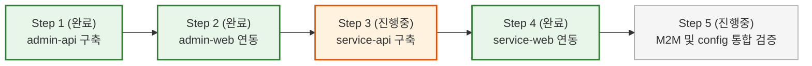

# Control Plane / Data Plane 분리 계획 (Access JWT + Refresh Token & S2S 아키텍처)

## 1. 아키텍처 목표 및 핵심 결정 사항

본 아키텍처는 중앙 집중식 인증 서버(`auth-service`)의 병목과 단일 장애점(SPOF)을 제거하고, 사내 운영망과 대고객 서비스망을 완벽하게 물리적 격리하는 것을 목표로 한다.
웹과 모바일 환경 모두에서 짧은 수명의 무상태 Access JWT와 서버에서 폐기 가능한 Refresh Token을 분리하는 **Access JWT + Refresh Token 인증 모델**을 채택한다.

---

### 최종 확정된 5대 핵심 의사결정

1. **도메인별 분산 인증 (Decentralized Auth)**:
   - 중앙 `auth-service`를 완전히 제거하고, `admin-api`(사내 관리자)와 `service-api`(고객 회원)가 각자의 인증 원장 DB를 독립 소유한다.
   - 사내 관리자 계정과 대고객 회원 계정은 물리적으로 완전히 다른 데이터베이스에서 보관된다.
2. **Control Plane 경유 데이터 열람 (`/api/v1/internal/*`)**:
   - 관리자 화면은 오직 `admin-api`만 호출한다 (단일 진입점).
   - 관리자의 모든 고객/서비스 데이터 조작은 `admin-api`에서 법적 필수 감사 로그(Audit Log)를 영구 기록한 후, `service-api`의 `/api/v1/internal/*` 라우팅을 호출한다.
3. **초단기 M2M 서명 토큰 기반 S2S 통신 (JWT)**:
   - 정적 API Key 대신 `admin-api`가 호출 시점에 **30초~1분 초단기 M2M JWT**를 서명 발급하여 `Authorization: Bearer <M2M_TOKEN>` 헤더로 전송한다.
   - 페이로드(`iss: 'admin-api'`, `aud: 'service-api'`, `sub: admin.id`, `iat`, `exp`)가 전자 서명되며, 요청 추적 ID는 `x-request-id` 헤더로 전달한다. 유출되더라도 1분 뒤 자동 무효화된다.
4. **Access JWT + Refresh Token 클라이언트 인증 모델**:
   - **AccessToken**: 10분 수명의 JWT다. 서버는 서명·iss·aud·exp를 로컬 검증하고 Redis를 조회하지 않는다.
   - **RefreshToken**: 랜덤 opaque 값이다. 서버는 SHA-256 해시 키와 사용자 식별자를 Redis에 저장하고, 갱신 시 기존 토큰을 폐기한 뒤 새 토큰을 발급한다.
   - **로그아웃**: Redis의 Refresh Token 레코드를 삭제한다. 이미 발급된 Access JWT는 남은 TTL 동안 유효하므로 수명을 짧게 유지한다.
5. **웹과 모바일 앱의 100% 동일한 REST API 공유**:
   - 향후 모바일 앱(Capacitor/Native) 도입 시 별도 모바일 전용 엔드포인트를 두지 않고, 웹과 동일한 REST API 규격을 그대로 공유한다.

---

## 2. 최종 실행 프로젝트 구성 (4개 체제)

| 프로젝트 | 계층 | 기술 스택 및 역할 |
| :--- | :--- | :--- |
| **`admin-web`** | 관리자 화면 | TanStack Router + React (메모리 AccessToken + HttpOnly Refresh Token 쿠키) |
| **`service-web`** | 서비스 화면 | TanStack Router + React (웹/모바일 단일 REST 규격 사용) |
| **`admin-api`** | Control Plane | NestJS: 사내 관리자 자체 인증(임직원 DB/SSO/OTP), 감사 로그, S2S 호출자 |
| **`service-api`** | Data Plane & Resource | NestJS: 대고객 회원 자체 인증(고객 DB/소셜가입), 비즈니스 도메인, `/api/v1/internal/*` 제공 |

```text
[관리자 시스템 (Admin Plane)]                  [대고객 서비스 시스템 (Service Plane)]
Admin Browser (React)                         User Browser & Mobile App
  • accessToken (10분, 메모리)                  • accessToken (10분, 메모리/Keychain)
  • refreshToken (HttpOnly 쿠키)                 • refreshToken (HttpOnly 쿠키 / Keychain)
           │                                             │
           ├─ Authorization: Bearer <accessToken>        ├─ Authorization: Bearer <accessToken>
           ▼                                             ▼
admin-api (Control Plane)                     service-api (Data Plane / Resource)
  • 🔐 사내 관리자 자체 인증 (사내 DB)          • 🔐 대고객 회원 자체 인증 (고객 DB)
  • Refresh Token 상태 관리 (Admin Redis)        • Refresh Token 상태 관리 (Service Redis)
  • RequestLogging 감사 로그 방출               • 웹/모바일 단일 API 서빙 (주문/상품/결제)
  • S2S 호출자 (초단기 M2M JWT 발급)             • /api/v1/internal/* 내부 엔드포인트 제공
           │                                             ▲
           └────── S2S M2M 호출 (Bearer <M2M_JWT>) ──────┘
                   GET /api/v1/internal/orders/:id
                   (iss: admin-api, aud: service-api, sub: admin-api)
```

---

## 3. Access JWT + Refresh Token 라이프사이클 흐름

### 3.1. 로그인 및 토큰 발급
1. 사용자가 ID/PW(또는 사내 SSO / 고객 소셜)로 `/api/v1/auth/login`을 호출한다.
2. 백엔드는 자격 증명을 검증하고 Refresh Token 레코드를 Redis에 생성한다:
   ```json
   {
     "sub": "user-1"
   }
   ```
3. 백엔드는 **초단기 AccessToken(10분)**을 발급한다:
   - **Response Body**: `{ accessToken: "eyJ..." }`
   - **Set-Cookie**: `{admin|service}_refresh_token="rt_..."; HttpOnly; Secure; SameSite=Lax; Path=/api/v1/auth` (웹 브라우저용)
   - **Response Body (모바일)**: `{ refreshToken: "rt_..." }` (모바일 보안 저장소 보관용)

### 3.2. 일상적인 고속 API 호출 (무상태)
- 클라이언트는 10분 동안 메모리의 `accessToken`을 `Authorization: Bearer` 헤더에 실어 호출한다.
- 백엔드는 Redis나 DB를 조회하지 않고 JWT 서명·만료·발급자·대상만 검증하여 고속 응답한다.

### 3.3. 토큰 만료 시 Refresh Token 기반 갱신 (`/api/v1/auth/token`)
1. 10분 후 `accessToken`이 만료되면 백엔드가 `401 Unauthorized`를 반환한다.
2. 클라이언트는 `/api/v1/auth/token`을 호출한다 (웹은 HttpOnly 쿠키, 모바일은 Body의 `refreshToken` 전달).
3. 백엔드는 Refresh Token의 해시로 Redis 레코드를 조회한다.
4. 유효하면 기존 Refresh Token을 삭제하고 새 Access JWT와 새 Refresh Token을 발급한다.
5. 기존 Refresh Token 재사용은 실패하며, Access JWT는 짧은 만료시간까지 유효하다.

### 3.4. 원격 강제 로그아웃 (Instant Revocation)
- 사용자가 로그아웃하거나 관리자가 계정을 정지시키면, Redis에서 해당 Refresh Token 키를 `DEL`한다.
- 기존 Access JWT는 최대 10분 내 만료되고, 이후 Refresh Token 갱신도 차단된다.

---

## 4. 관리자의 서비스 리소스 접근 및 양방향 S2S M2M 통신

### 4.1. 관리자의 서비스 데이터 열람 (`admin-api` ➔ `service-api`)
1. **관리자 요청**: 브라우저 ➔ `admin-api` (`GET /api/v1/orders/123`, `Authorization: Bearer <Admin JWT>`)
2. **Control Plane 감사 및 인가**:
   - `admin-api`가 관리자 권한을 검증하고 `RequestLoggingMiddleware`로 감사 로그를 출력한다.
   - 대상 목적지(`aud: 'service-api'`)를 명시한 **초단기(30초~1분) M2M JWT**를 새로 서명 생성한다.
3. **S2S 내부 위임 호출**:
   - `admin-api`가 사설망(VPC)을 통해 `service-api`의 내부 엔드포인트를 호출한다:
     ```http
     GET /api/v1/internal/orders/123 HTTP/1.1
     Host: service-api.internal
     Authorization: Bearer <M2M_JWT>
     ```
     - 페이로드: `{ "iss": "admin-api", "aud": "service-api", "sub": "admin-api", "iat": 1789649500, "exp": 1789649560 }`
4. **Data Plane 내부 처리**:
   - `service-api`는 `M2mAuthGuard`로 M2M JWT 서명 및 `aud: 'service-api'`를 검증한 후, 고객 소유권 필터 없이 주문 DB를 조회하여 반환한다.
5. **마스킹 및 최종 반환**:
   - `admin-api`는 필요 시 개인정보(주민번호/계좌번호)를 마스킹하여 관리자 화면에 반환한다.

### 4.2. 서비스 설정 관리 위임 (`admin-api` ➔ `service-api`)
- 고객 서비스의 동작에 영향을 주는 `SystemConfig`의 원장은 `service-api`의 `service_db`입니다.
- 관리자는 `admin-web`에서 기존 설정 화면을 사용합니다. `admin-api`는 관리자 권한을 확인하고 감사 로그를 남긴 뒤 기존 M2M 인증으로 `service-api` 내부 설정 API를 호출합니다.
- `service-api`는 요청을 검증해 `service_db.system_config`에 저장하고, 운영시간·점검·문의 설정의 런타임 스냅샷을 Redis에 동기화합니다. OAuth 아이콘 파일과 업로드 메타데이터도 서비스가 소유합니다. 고객 요청 경로는 Redis의 런타임 값을 사용합니다.
- 설정 조회, 값 조회, 수정, 명시적 Redis 동기화 모두 `iss: 'admin-api'`, `aud: 'service-api'` M2M 인증을 사용합니다. 공개 관리자 API 계약과 권한 검사는 유지됩니다.

### 4.3. 다중 홉(Multi-Hop) 인증 전파 원칙 (패턴 1 준용)
- 서비스 간 호출이 2개 이상의 홉(A ➔ B ➔ C)으로 이어질 경우, 이전 홉에서 받은 토큰을 그대로 전달(토스)하지 않고 **각 서버가 다음 목적지(`aud`)를 향해 신규 M2M JWT를 즉시 서명 발급**합니다.
- 각 홉은 목적지에 맞는 새 토큰을 발급하며, `requestId`는 JWT가 아닌 `x-request-id` 헤더로 전파합니다.

---

## 5. 저장소 및 물리적 격리 기준

| 항목 | 관리 위치 | 세부 규격 및 목적 |
| :--- | :--- | :--- |
| **`accessToken`** | 브라우저 메모리 / 앱 Keychain | • **Admin**: `iss: 'admin-api'`, `aud: 'admin-api'` (10분 무상태 API 호출)<br>• **Service**: `iss: 'service-api'`, `aud: 'service-api'` (10분 무상태 API 호출) |
| **`refreshToken` (쿠키)** | 브라우저 HttpOnly 쿠키 / 앱 Keychain | • **Admin**: `admin_refresh_token` (SameSite=Lax, Path=/api/v1/auth)<br>• **Service**: `service_refresh_token` (SameSite=Lax, Path=/api/v1/auth)<br>※ 동일 도메인/포트 환경에서도 브라우저 세션 덮어쓰기 충돌 완전 방지 |
| **Admin Redis** | `admin-api` 전용 Redis | • 네임스페이스: `admin:auth_token:refresh:*`, `refresh_used:*`, `refresh_family:*`<br>• Refresh Token 레코드 저장, rotation, family 재사용 탐지 및 revocation |
| **Service Redis** | `service-api` 전용 Redis | • 네임스페이스: `service:auth_token:refresh:*`, `refresh_used:*`, `refresh_family:*`<br>• Refresh Token 레코드 저장, rotation, family 재사용 탐지 및 revocation |
| **Admin PostgreSQL** | `admin-api` 전용 DB (`admin_db`) | 사내 관리자 원장, 사내 RBAC 역할/권한, 감사 로그 |
| **Service PostgreSQL** | `service-api` 전용 DB (`service_db`) | 대고객 회원 원장, 고객 멤버십, 주문/상품/결제 등 비즈니스 데이터, 서비스 운영 설정 |

---

## 6. 엔티티 도메인 분장 및 스키마 설계 기준 (Better-Auth 표준 명칭 준용)

DB 스키마(물리 DB)가 완전히 격리되어 있으므로 **테이블명에 `admin_`, `service_` 등의 접두사를 붙이지 않고** Better-Auth 표준 명칭(`user`, `account`, `session`)을 그대로 사용합니다.

### 6.1. 전체 엔티티 분장표 (`template/nest-starter-kit` 기준)

| 도메인 | 실물 엔티티 명칭 | `admin-api` (Control Plane) | `service-api` (Resource Plane) | 역할 및 분리 배치 이유 |
| :--- | :--- | :---: | :---: | :--- |
| **인증/식별** | `user`<br>`account` | **O** (사내 DB) | **O** (고객 DB) | • **Admin**: 사내 관리자 계정, 사번/부서, 로그인 자격증명<br>• **Service**: 대고객 회원 원장, 소셜 OAuth 로그인 연동 |
| **역할 / 멤버십** | `role`<br>`resource` (permission)<br>`user_role` | **O** (사내 RBAC) | **O** (고객 멤버십) | • **Admin (사내 RBAC)**: 직책별 세부 인가 및 API/메뉴 접근 통제 (`@Permission`)<br>• **Service (고객 Membership)**: 서비스 혜택/기능 접근 레벨 관점의 **멤버십 등급(Tier)**. 기능 테스트 및 홍보용 **`SUPER_USER`** 기본 배치 및 향후 유료 플랜/멤버십 확장 대응 |
| **약관 및 서약** | `term`<br>`term_group`<br>`user_term_agreement` | **O** (사내 DB) | **O** (고객 DB) | • **Admin**: 사내 정보보호 서약서, 개인정보 취급 서약서, 관리 시스템 이용 서약<br>• **Service**: 대고객 서비스 이용약관, 개인정보 처리방침, 마케팅 동의 |
| **2차 인증 (2FA)** | `two_factor` | **O** (사내 DB) | **O** (고객 DB) | • **Admin**: 관리자 OTP 의무 적용<br>• **Service**: 고액 결제/개인정보 변경/보안 강화 고객 선택형 2FA |
| **운영 설정** | `system_config` | X (S2S 관리 프록시) | **O** (원장 소유) | • **Service**: 서비스 운영 설정의 저장과 런타임 동기화 담당<br>• **Admin**: 권한 확인·감사 후 M2M으로 설정 관리 요청 전달 |
| **공지사항** | `notice`<br>`notice_read` | X (S2S 관리) | **O** (원장 소유) | • **Service**: 대고객 공지사항 서빙 및 읽음 확인 (관리자는 S2S로 등록/수정) |
| **고객 지원 (CS)** | `faq`<br>`inquiry`, `inquiry_message`<br>`support_ticket` | X (S2S 관리) | **O** (원장 소유) | • **Service**: 대고객 1:1 문의, FAQ, CS 티켓 원장 (관리자는 S2S로 답변 처리) |
| **알림 (Alerts)** | `alert` | X | **O** (원장 소유) | • **Service**: 대고객 웹/앱 실시간 알림 피드 |
| **본인인증** | `verification` | X | **O** | • **Service**: 대고객 회원가입/비밀번호 찾기 휴대폰·이메일 본인인증 토큰 |
| **파일 업로드** | `upload` | X (서비스 파일 S2S 프록시) | **O** | • 고객 화면에서 쓰는 OAuth 아이콘과 업로드 메타데이터는 Service 소유<br>• Admin은 관리자 권한 확인 후 업로드/조회 요청을 중계 |
| **세션** | `session` | **미사용** | **미사용** | • 별도 세션 테이블이나 세션 쿠키는 사용하지 않음<br/>• Refresh Token 원문은 저장하지 않고 SHA-256 hash를 Redis key로 사용 |
| **감사 로그** | `audit_log` | **제거 (로거 대체)** | - | • DB 테이블 삭제 ➔ `RequestLoggingMiddleware` 기반 실시간 JSON 로그 방출 |

### 6.2. `SystemConfig`의 저장 및 소비 아키텍처
1. **원장 관리 (Source of Truth)**: `service-api`가 `service_db.system_config`와 OAuth 아이콘 파일/메타데이터를 소유하고, 설정 관리 화면은 `admin-web`에 둡니다. `admin-api`는 서비스 설정과 아이콘 업로드 요청을 저장하지 않고 권한 확인과 감사 기록 후 service-api로 중계합니다.
2. **수정 흐름**: 관리자의 요청은 `admin-api`를 거쳐 M2M으로 `service-api` 내부 API에 도달합니다. `service-api`가 데이터를 검증하고 DB에 저장합니다.
3. **런타임 소비**: 저장된 운영시간·점검·문의 설정은 Redis 스냅샷으로 동기화되고 `service-api`가 이를 소비합니다. DB/Redis 동기화 실패는 성공한 설정 변경으로 응답하지 않습니다.
4. **초기 데이터**: 아직 서비스 오픈 전이므로 `service-api`의 시더가 기본 설정을 생성합니다. `admin-api`의 레거시 `system_config` 테이블은 마이그레이션으로 제거합니다.
5. **OAuth 아이콘 업로드**: 관리자 권한을 확인하는 공개 요청은 admin-api가 받고, 업로드 URL 발급·파일 저장·`upload` 메타데이터 생성과 공개 서빙은 service-api가 담당합니다. 브라우저 업로드와 관리자 화면의 아이콘 조회는 admin-api가 service-api로 M2M 중계하며, 실제 파일은 service-api 저장소에만 보관합니다.

### 6.2.1. Admin 운영 설정과 Service 설정의 경계
- **Service 설정**: `service_db.system_config`는 고객에게 제공하는 서비스의 동작 설정만 소유합니다. 현재 `operation`, `maintenance`, `security`, `inquiry`, `notification`, `oauth`가 여기에 속합니다. 관리자 화면은 이 값을 편집하지만, 저장 원장과 런타임 사용자는 service-api입니다.
- **Admin 운영 설정**: Admin 계정 복구 토큰과 재설정 링크 생성, 발송 정책은 admin-api의 인증/운영 도메인이 소유합니다. 이메일 발송 설정 원장은 Admin DB의 `system_config` 중 `email` 카테고리이며, SMTP 비밀번호는 `APP_SECRET`으로 암호화해 저장합니다. Service DB에도 별도의 `system_config` 테이블이 있지만 DB가 분리되어 있습니다.
- **메일 전송 경로**: admin-api는 저장된 SMTP 설정을 사용해 사설 SMTP 릴레이로 메일을 전송합니다. 네트워크에서 Admin API의 SMTP 목적지를 해당 사설 릴레이로 제한합니다. Service API는 Admin 계정 복구 메일을 중계하지 않습니다.
- **경계 원칙**: `service_db.system_config.notification.email.smtp`는 고객 서비스 알림 전용이고, Admin 복구 메일 설정과 공유하지 않습니다. 설정 화면과 API도 서비스 설정과 Admin 운영 설정을 별도 영역으로 제공합니다.

### 6.3. Better-Auth 기반 다중 인증 및 OAuth 수용 구조
- **단일 `account` 테이블로 일반 로그인 및 다중 OAuth 완전 대응**:
  - `providerId = 'credential'`: 일반 비밀번호 로그인 (`password` 해시 보관)
  - `providerId = 'google' | 'kakao' | 'apple'`: 소셜 OAuth 연동 (`accountId`, `accessToken`, `refreshToken`, `idToken`, `scope` 보관)
  - 별도 OAuth 테이블 없이 `account`의 다중 행(1:N)으로 소셜 계정 바인딩 및 Account Linking 지원

### 6.4. 부트스트랩 계정 및 불변성 규칙 (Invariant Rules)
시스템 고아(Orphan) 락 및 좀비 계정 부활 버그를 원천 차단하기 위해 다음 불변 규칙을 적용합니다:

| 대상 시스템 | 계정 역할/멤버십 | 부트스트랩 환경변수 | 불변 규칙 및 정책 |
| :--- | :--- | :--- | :--- |
| **`admin-api`** | `SUPER_ADMIN` (사내 최고관리자) | `ADMIN_INIT_EMAIL`<br>`ADMIN_INIT_PASSWORD` | • 계정 삭제 원천 차단 (`403 Forbidden`)<br>• 잔여 관리자가 2명 이상일 때만 강등 가능 (`count <= 1` 시 차단)<br>• DB 내 0명일 때만 최초 1회 생성 |
| **`service-api`** | `SUPER_USER` (기능테스트/홍보용 멤버십) | `SUPER_USER_INIT_EMAIL`<br>`SUPER_USER_INIT_PASSWORD` | • 테스트 및 프로모션용 특수 멤버십 티어<br>• DB 내 0명일 때만 초기 계정 1회 시딩 |

---

## 7. 엔티티 관리 및 영속성 아키텍처 (Entity Management)

본 프로젝트는 `template/nest-starter-kit`의 표준 엔티티 관리 패턴을 100% 동일하게 계승합니다.

### 7.1. 핵심 원칙
1. **별도 Repository 계층 금지 (No Repositories)**:
   - 중복적이고 얇은 CRUD 추상화 레이어를 만들지 않습니다.
   - CQRS Command/Query 핸들러에 **`AppEntityManager`를 직접 주입**하여 `em.find()`, `em.persist()`, `em.flush()`를 직접 다룹니다.
2. **단일 진실 공급원(`entities.generated.ts`)을 통한 자동 디스커버리**:
   - 엔티티를 수동으로 모듈마다 등록하지 않고, MikroORM CLI의 discovery 기능(`pnpm mikro-orm discovery:export`)을 통해 `src/entities.generated.ts` 파일을 자동 생성 및 갱신합니다.
   - 모든 엔티티의 타입과 매핑이 `entities.generated.ts`의 `entities` 배열과 `EntityManager` 타입으로 일원화 관리됩니다.
3. **공통 감사 추적 (`BaseEntity` & `AuditSubscriber`)**:
   - 모든 비즈니스 엔티티는 `BaseEntity`(`id`, `createdAt`, `updatedAt`, `deletedAt`, `createdBy`, `updatedBy`, `deletedBy`)를 상속합니다.
   - MikroORM의 `AuditSubscriber`가 `SessionContext`의 현재 로그인 사용자 ID를 감지하여 생성자/수정자/삭제자 및 타임스탬프를 자동 주입합니다.

---

## 8. 단계별 구현 및 검증 로드맵 (Action Items)



| 단계 | 대상 프로젝트 | 주요 작업 내용 | 진행 상태 |
| :---: | :--- | :--- | :---: |
| **Step 1** | **`apps/admin-api`** | • MikroORM DB 연동 및 엔티티 생성 (`user`, `account`, `role`, `permission`, `term*`, `two_factor`, `upload`)<br>• Redis 기반 Refresh Token 저장소 (`admin:auth_token:refresh:*`) 및 쿠키(`admin_refresh_token`)<br>• `SUPER_ADMIN` 불변 규칙 및 부트스트랩 Seeder 구현<br>• RequestLoggingMiddleware 감사 로그 및 초단기 M2M JWT 발급 기반 마련 | **완료 (통과)** |
| **Step 2** | **`apps/admin-web`** | • 관리자 프론트엔드에 Access JWT + Refresh Token 클라이언트 연동 (`admin_refresh_token` 쿠키 전송)<br>• 관리자 로그인 페이지 및 기본 대시보드 보호 라우트 연결<br>• E2E 인증 플로우 검증 | **완료 (통과)** |
| **Step 3** | **`apps/service-api`** | • `service_db` 접속 및 독립 인증 구성 (JWT issuer/aud: `service-api`)<br>• Refresh Token 쿠키(`service_refresh_token`) 및 Redis 네임스페이스(`service:auth_token:refresh:*`) 격리<br>• 고객 멤버십 관점의 `role` 구성 및 `SUPER_USER` 부트스트랩 Seeder<br>• **[다음 과제] `/api/v1/internal/*` 라우팅 + M2M 토큰 검증 가드(`InternalServiceGuard`) 구현 및 대고객 도메인 정돈** | **진행 중** |
| **Step 4** | **`apps/service-web`** | • 고객 서비스 화면에 Access JWT + Refresh Token 클라이언트 연동 (`service_refresh_token` 쿠키 전송)<br>• 독자 브랜드/UI 텍스트 정돈 및 대시보드 라우트 연결<br>• E2E 인증 플로우 검증 통과 | **완료 (통과)** |
| **Step 5** | **통합 검증 (E2E)** | • 관리자 화면(`admin-web`)에서 고객 데이터 조회 요청 ➔ `admin-api` 감사 로그 출력 후 S2S M2M으로 `service-api`의 `/api/v1/internal/*` 데이터 조회되는 전 과정 실시간 검증 | **예정** |
