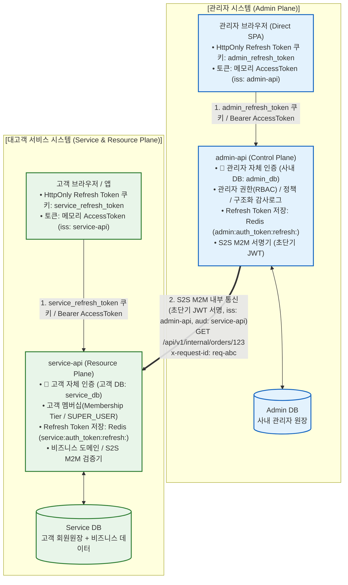
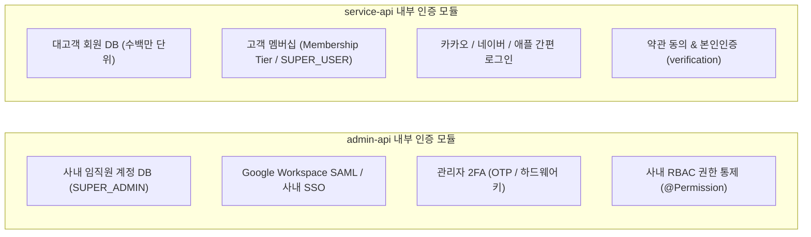
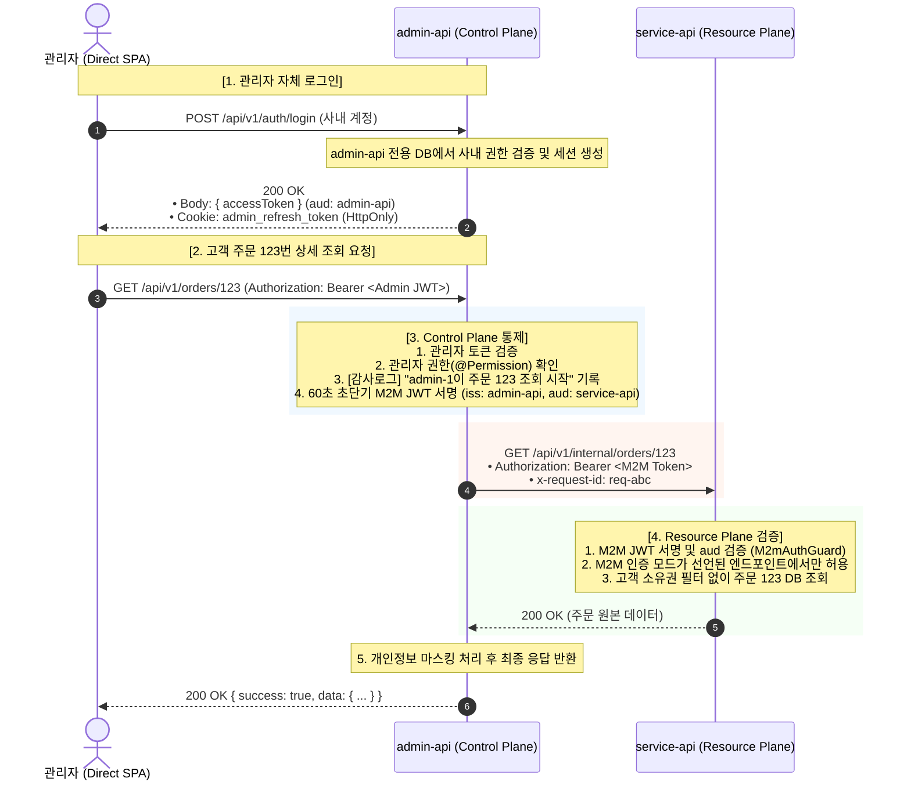

# 독립 인증(Decentralized Auth) & 리소스 서비스 M2M 아키텍처 명세서

본 문서는 중앙 집중식 `auth-service`를 완전히 제거하고, **관리자 인증은 `admin-api`에, 고객 인증은 `service-api`에 독립 구축**하며, 두 서비스 간의 데이터 교환을 **비대칭키 기반 S2S M2M(Private Key JWT)**으로 처리하는 아키텍처를 상세히 정의합니다.

> 📖 **상세 구현 및 시각 다이어그램 문서**: [m2m-pipeline-architecture.md](file:///Users/server/Documents/GitHub/web-framework-app/docs/m2m-pipeline-architecture.md)에 포트 맵, 토폴로지, 시퀀스, 가드 파이프라인 및 테스트 매트릭스가 집대성되어 있습니다.

---

## 1. 프로젝트 재구성 (5개 ➔ 4개 체제)

중앙 인증 서버(`auth-service`)가 제거되고, 관리자망(Admin Plane)과 대고객 서비스망(Service Plane)이 완전히 분리된 4개 프로젝트로 운영됩니다.

| 프로젝트 | 계층 | 인증 및 주요 책임 |
| :--- | :--- | :--- |
| **`admin-web`** | 화면 (Control Plane UI) | 관리자 TanStack Start React SPA (HttpOnly Refresh Token 쿠키: `admin_refresh_token`, 메모리 AccessToken) |
| **`admin-api`** | Control Plane | **🔐 사내 관리자 인증 전담 (사내 계정 / 2FA / SSO)** 사내 RBAC, 운영 정책, 감사 로그(Audit), M2M 서명기 (초단기 JWT 발급) |
| **`service-web`**| 화면 (Data Plane UI) | 대고객 TanStack Start React SPA (HttpOnly Refresh Token 쿠키: `service_refresh_token`, 메모리 AccessToken) |
| **`service-api`**| Resource & Data | **🔐 대고객 회원 인증 전담 (소셜로그인 / 일반가입 / 본인인증)** 고객 멤버십(Role = Membership Tier, SUPER_USER 기본 탑재) 주문/상품/결제 등 비즈니스 도메인 데이터, M2M 수신자 (`/api/v1/internal/*`) |

---

## 2. 전체 시스템 아키텍처 다이어그램

중앙 허브 없이 두 비즈니스 도메인이 완벽하게 독립되어 동작합니다.

---

## 3. 인증 처리의 독립 분리 (비교)

각 API는 대상 고객의 특성에 맞게 완전히 다른 인증 방식을 최적화하여 탑재합니다.

* **`admin-api`**: 대규모 트래픽 처리가 필요 없으며, **보안성과 사내 인증(SSO/2FA/RBAC)**에 집중.
* **`service-api`**: 보안성과 더불어 **초당 수만 건의 로그인/가입 트래픽과 고객 멤버십 및 소셜 확장성**에 집중.

---

## 4. 관리자의 서비스 리소스 접근 흐름 (S2S M2M 시퀀스)

관리자가 특정 고객의 주문 정보를 조회하거나 환불 처리할 때의 흐름입니다.

---

## 5. 이 아키텍처가 제공하는 4가지 결정적 장점

1. **완벽한 물리적 격리 (No Mixed DB)**:
   * 관리자 계정 DB(`admin_db`)와 일반 고객 회원 DB(`service_db`)가 테이블 수준이 아니라 **완전히 물리적으로 다른 서버/DB**로 분리됩니다.
   * 고객 서비스 DB가 침해당해도 관리자 계정 정보는 1%도 유출되지 않습니다.
2. **단일 장애점(SPOF) 제거**:
   * 중앙의 `auth-service`가 없으므로, 프로모션/이벤트로 일반 고객 서비스에 트래픽이 폭증해 장애가 발생해도, **사내 관리자 시스템은 100% 독립적으로 정상 가동**됩니다.
3. **쿠키 및 세션 충돌 없는 Direct SPA**:
   * `admin_refresh_token`과 `service_refresh_token` 쿠키 분리를 통해 동일 브라우저/도메인에서도 세션 덮어쓰기 없이 상호 독립 운영됩니다.
4. **Zero Trust 기반 M2M 보안**:
   * `service-api`는 외부에 노출되는 엔드포인트와 내부 전용 엔드포인트(`/api/v1/internal/*`)를 철저히 분리하며, 내부 통신은 `admin-api`의 전자 서명으로만 인가합니다.
