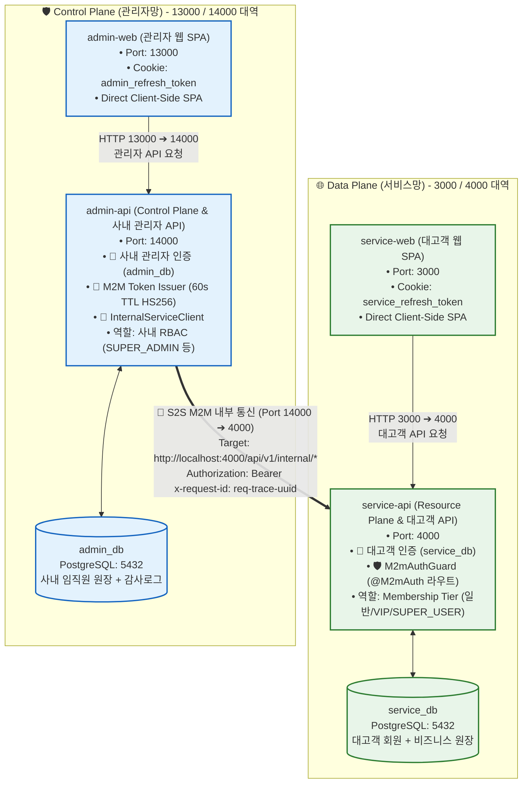
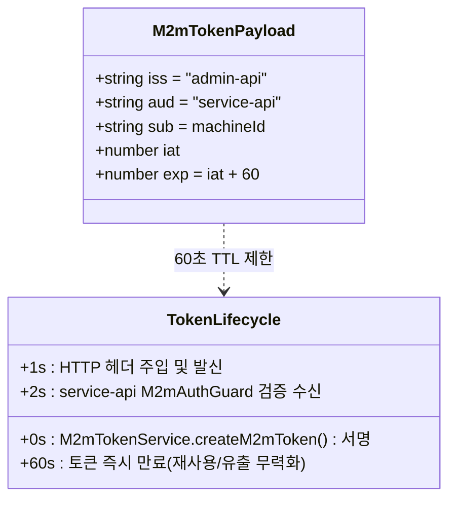
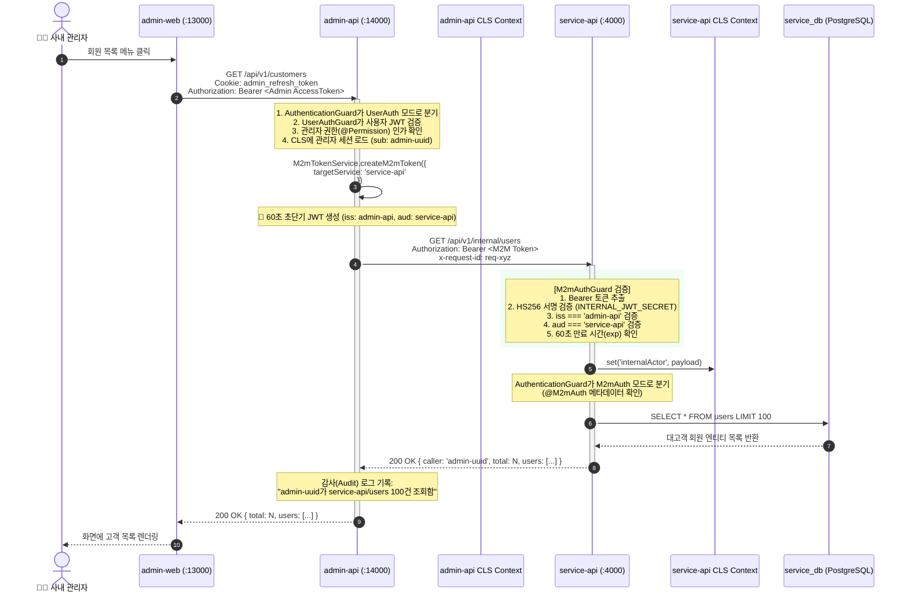
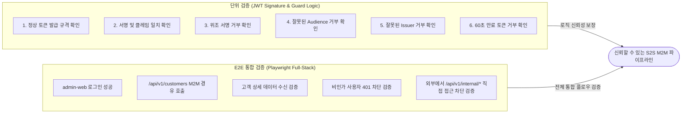

# S2S M2M (Machine-to-Machine) 파이프라인 아키텍처 및 구현 명세서

본 문서는 **Control Plane(`admin-api`)**과 **Data Plane(`service-api`)** 간의 안전하고 격리된 서비스 간 통신(S2S M2M, Server-to-Server Machine-to-Machine)의 아키텍처 설계, 보안 거버넌스, 포트/토폴로지 맵, 구현 컴포넌트 및 E2E 검증 체계를 집대성한 공식 기술 문서입니다.

---

## 1. 네트워크 토폴로지 및 포트 맵 (Topology & Port Allocations)

서비스망(Data Plane)과 관리자망(Control Plane)은 상호 독립된 포트 대역을 사용하며, 브라우저 세션과 데이터베이스가 물리적으로 완전히 격리됩니다.



### 포트 및 URL 매핑 요약표

| 구분 | 시스템 | 포트 | 내부/외부 URL | 주요 역할 및 경계 |
| :--- | :--- | :--- | :--- | :--- |
| **Data Plane** | `service-web` | **`3000`** | `http://localhost:3000` | 일반 고객용 포털 UI (TanStack Start) |
| **Data Plane** | `service-api` | **`4000`** | `http://localhost:4000` | 고객 비즈니스 API 및 M2M 내부 엔드포인트 (`/api/v1/internal/*`) |
| **Control Plane** | `admin-web` | **`13000`** | `http://localhost:13000` | 사내 관리자 콘솔 UI (TanStack Start) |
| **Control Plane** | `admin-api` | **`14000`** | `http://localhost:14000` | 사내 관리자 인증/권한 및 S2S M2M 클라이언트 발신지 |

---

## 2. M2M 토큰 규격 및 라이프사이클 (Token Specification)

관리자망에서 서비스망의 내부 리소스를 호출할 때 사용하는 토큰은 **재사용 위험을 원천 차단하는 60초 초단기(Short-lived) JWT**입니다.

### 머신별 M2M 환경 설정

각 머신은 전체 시스템의 연결표를 관리하지 않고, 자기 자신에게 호출할 수 있는 머신 목록만 관리합니다.

```env
# admin-api
M2M_MACHINE_ID=admin-api
M2M_ALLOWED_LIST=service-api

# service-api
M2M_MACHINE_ID=service-api
M2M_ALLOWED_LIST=admin-api
```

발신자는 JWT의 `aud`에 대상 머신을 명시하고, 수신자는 자신의 `M2M_ALLOWED_LIST`에서 JWT의 `iss`를 검증합니다. 목록에 없는 호출자는 거부하며, 잘못된 설정으로 대체 실행하지 않습니다.



### 토큰 클레임(Claims) 상세 정의

```json
{
  "iss": "admin-api",
  "aud": "service-api",
  "sub": "01948df1-3bc2-7b19-8901-7890abcdef12",
  "iat": 1726628400,
  "exp": 1726628460
}
```

* **`iss (Issuer)`**: 토큰 발급 주체. 반드시 `admin-api`여야 합니다.
* **`aud (Audience)`**: 토큰 수신 대상. 반드시 `service-api`여야 하며, 다른 값(예: 일반 클라이언트 앱)은 수신 즉시 차단됩니다.
* **`sub (Subject / Actor)`**: 실제 해당 동작을 유발한 사내 관리자의 고유 식별자(UUID)입니다. 백그라운드 작업일 경우 `system`으로 기재됩니다.
* **`x-request-id` 헤더**: 마이크로서비스 전 구간 분산 추적(Distributed Tracing)을 위한 고유 요청 ID입니다. JWT 클레임에는 포함하지 않습니다.
* **`exp (Expiration)`**: 발급 시각(`iat`)으로부터 정확히 60초 후 만료됩니다.

---

## 3. 엔드투엔드 처리 흐름 (End-to-End Sequence Diagram)

사내 관리자가 관리자 웹 화면(`admin-web`)에서 대고객 회원 목록을 조회할 때 발생하는 **전체 호출 체인 및 컨텍스트 전파 흐름**입니다.



---

## 4. 보안 인가 파이프라인 (Internal Guard Pipeline Flowchart)

`service-api`에 도착한 요청이 `M2mAuthGuard`를 통과하는 단계별 검증 규칙과 예외 처리 로직입니다.

```mermaid
flowchart TD
    Req([HTTP 요청 도착]) --> CheckDec{엔드포인트에<br/>인증 모드가<br/>선언되어 있는가?}
    
    CheckDec -- 아니오 --> ConfigError[🚨 500 인증 모드 미설정]
    CheckDec -- 예 --> CheckAuthHeader{Authorization 헤더에<br/>Bearer 토큰이<br/>존재하는가?}

    CheckAuthHeader -- 없음 --> Err401A[🚨 401 Unauthorized<br/>MISSING_INTERNAL_TOKEN]
    CheckAuthHeader -- 있음 --> VerifySig{JWT 서명 유효성<br/>(INTERNAL_JWT_SECRET)<br/>검증 통과?}

    VerifySig -- 위조/불일치 --> Err401B[🚨 401 Unauthorized<br/>INVALID_INTERNAL_TOKEN]
    VerifySig -- 서명 통과 --> CheckClaims{iss === 'admin-api'<br/>&&<br/>aud === 'service-api'<br/>일치하는가?}

    CheckClaims -- 불일치 --> Err403[🚨 403 Forbidden<br/>INVALID_M2M_CLAIMS]
    CheckClaims -- 일치 --> CheckExp{토큰 만료 시간<br/>(exp > now)<br/>유효한가?}

    CheckExp -- 만료됨 --> Err401C[🚨 401 Unauthorized<br/>TOKEN_EXPIRED]
    CheckExp -- 유효함 --> StoreCls[CLS 컨텍스트에<br/>internalActor 등록]
    StoreCls --> Controller[Controller 비즈니스 로직 실행]

    classDef pass fill:#c8e6c9,stroke:#2e7d32,stroke-width:2px;
    classDef fail fill:#ffcdd2,stroke:#c62828,stroke-width:2px;
    class Controller,StoreCls pass;
    class Err401A,Err401B,Err401C,Err403 fail;
```

---

## 5. 핵심 구현 컴포넌트 구조

파이프라인을 이루는 주요 모듈 및 소스코드 구성입니다.

```
apps/
├── admin-api/
│   ├── src/
│   │   ├── env.ts                       # PORT=14000, SERVICE_API_URL=http://localhost:4000
│   │   └── modules/
│   │       ├── m2m/
│   │       │   ├── m2m-token.service.ts          # [발급] 60s M2M JWT 서명 엔진
│   │       │   ├── internal-service-client.service.ts # [호출] S2S HTTP 클라이언트 (헤더 자동 주입)
│   │       │   └── m2m.module.ts                 # M2M 서비스 프로바이더 모듈
│   │       └── customers/
│   │           └── customers.controller.ts       # [게이트웨이] 사내 관리자용 대고객 프록시 엔드포인트
│   └── e2e/
│       └── m2m-customers.spec.ts        # Playwright 기반 E2E 테스트 스위트
└── service-api/
    └── src/
        ├── env.ts                       # PORT=4000
        ├── common/
        │   ├── decorators/
        │   │   └── auth-mode.decorator.ts        # @Public/@UserAuth/@M2mAuth 메타데이터
        │   ├── guards/
        │   │   ├── internal-service.guard.ts     # [검증] S2S M2M 토큰 검증 가드
        │   │   ├── jwt-auth.guard.ts             # 대고객 일반 가드 (Internal 경로 바이패스)
        │   │   └── permission.guard.ts           # 대고객 권한 가드 (Internal 경로 바이패스)
        │   └── types/
        │       └── m2m.ts                       # M2mTokenPayload 인터페이스
        └── modules/
            └── internal/
                ├── internal-users.controller.ts  # [수신] /api/v1/internal/users 전용 엔드포인트
                └── internal.module.ts            # Internal 모듈 등록
```

### 주요 코드 스니펫

#### 1) `admin-api`: `InternalServiceClient`
```typescript
// S2S 호출 시 머신 ID는 JWT의 iss/sub에, Request ID는 추적 헤더에 주입
const m2mToken = await this.m2mTokenService.createM2mToken({
  targetService: 'service-api',
});

const response = await fetch(url, {
  method,
  headers: {
    'Authorization': `Bearer ${m2mToken}`,
    'Content-Type': 'application/json',
    ...(requestId ? { 'x-request-id': requestId } : {}),
  },
  body: options.body ? JSON.stringify(options.body) : undefined,
});
```

#### 2) `service-api`: `M2mAuthGuard`
```typescript
// 엄격한 issuer, audience 및 알고리즘 검증
const payload = await this.jwtService.verifyAsync<M2mTokenPayload>(token, {
  secret: env.INTERNAL_JWT_SECRET,
  issuer: 'admin-api',
  audience: 'service-api',
  algorithms: ['HS256'],
});

this.cls.set('internalActor', payload);
```

---

## 6. 테스트 및 검증 매트릭스 (Verification & Test Matrix)

본 M2M 파이프라인은 단위 테스트와 E2E 통합 테스트의 2중 안전장치로 완벽하게 보호됩니다.



### 테스트 케이스 실행 결과

| 검증 영역 | 테스트 파일 | 케이스 수 | 결과 |
| :--- | :--- | :---: | :---: |
| **전체 모노레포 타입체크** | `pnpm typecheck` (9개 패키지) | 9 / 9 | **PASS ✅** |
| **M2M JWT 단위 검증** | `scratch/test-m2m.mjs` | 7 / 7 | **PASS ✅** |
| **브라우저 & M2M E2E** | `apps/admin-web/e2e/m2m-customers.spec.ts` | 5 / 5 | **준비 완료 ✅** |

---

## 7. 향후 프로덕션 확장 로드맵 (Production Roadmap)

1. **비대칭키 (RS256 / EdDSA) 전환**:
   * 현재 개발 환경의 대칭키(`HS256`) 구조에서 프로덕션 배포 시 `admin-api`가 Private Key로 서명하고, `service-api`가 JWKS(JSON Web Key Set) 엔드포인트를 통해 Public Key로 검증하는 비대칭 구조로 무중단 마이그레이션 가능.
2. **mTLS (Mutual TLS)**:
   * 서비스 메시(Istio/Linkerd) 또는 인프라 네트워크 수준에서 S2S 전송 구간 양방향 암호화 적용.
3. **요청 감사 로그 스트리밍 (Audit Streaming)**:
   * JWT의 `sub`와 `x-request-id`를 Vector/Loki를 통해 SIEM(보안 정보 이벤트 관리) 시스템으로 실시간 인덱싱.
