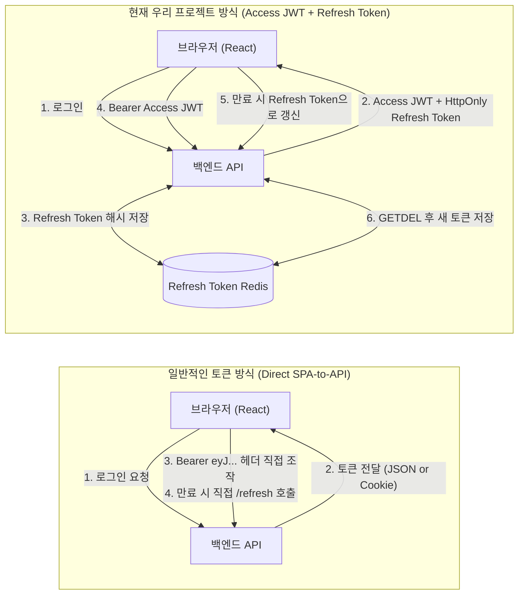

# 토큰 기반 인증(Token-based Auth) 구현 패턴 및 현재 구조

본 문서는 **1) 일반적인 웹/앱 환경에서 토큰(Access/Refresh Token)을 이용한 로그인 구현 표준**, **2) 토큰 저장 위치별 보안 트레이드오프**, 그리고 **3) 현재 프로젝트의 Stateless Access JWT + Stateful Refresh Token 구조**를 시각화하여 기술합니다.

---

## 1. 일반적인 토큰 기반 인증의 표준 흐름 (Access + Refresh Token)

BFF 없이 클라이언트(SPA/모바일)가 백엔드 API와 직접 통신할 때 전 세계적으로 가장 널리 쓰이는 표준 방식입니다.

```mermaid
sequenceDiagram
    autonumber
    actor User as 사용자 (Browser / SPA)
    participant API as 백엔드 인증 API

    %% 1. 로그인
    Note over User, API: [1단계] 로그인 및 듀얼 토큰 발급
    User->>API: POST /api/auth/login (ID / Password)
    Note over API: 1. 자격 증명 검증<br/>2. Access Token (15분, 메모리/헤더용) 발급<br/>3. Refresh Token (14일, DB에 해시 저장) 발급
    API-->>User: 200 OK<br/>• Body: { accessToken: "eyJ..." }<br/>• Set-Cookie: refreshToken="xyz..."; HttpOnly; Secure; SameSite=Strict

    %% 2. API 호출
    Note over User, API: [2단계] 일반 API 요청
    User->>API: GET /api/orders (Authorization: Bearer <accessToken>)
    Note over API: Access Token 서명 및 만료시간(exp) 검증
    API-->>User: 200 OK { data: ... }

    %% 3. 토큰 만료 및 갱신 (Silent Refresh)
    Note over User, API: [3단계] 토큰 만료 시 무중단 자동 갱신
    User->>API: GET /api/orders (만료된 accessToken)
    API-->>User: 401 Unauthorized (TOKEN_EXPIRED)

    Note over User, API: 클라이언트 Axios Interceptor가 가로채서 갱신 요청
    User->>API: POST /api/auth/refresh (Cookie: refreshToken 자동 전송)
    Note over API: 1. DB의 Refresh Token과 대조<br/>2. 새 Access Token 발급<br/>3. (권장) Refresh Token 회전(RTR)
    API-->>User: 200 OK { accessToken: "새로운_토큰" }

    Note over User, API: 원래 실패했던 요청 1회 재시도
    User->>API: GET /api/orders (새로운 accessToken)
    API-->>User: 200 OK { data: ... }
```

---

## 2. 토큰을 어디에 보관하는가? (보관 위치별 3대 패턴)

일반적인 토큰 인증에서 브라우저가 토큰을 보관하는 3가지 방식의 보안 구조도입니다.

```mermaid
flowchart TD
    subgraph Pattern1["패턴 A. LocalStorage 보관 (비권장)"]
        LS["브라우저 localStorage / sessionStorage\n• Access Token과 Refresh Token 모두 저장"]
        LS_Risk["⚠️ 치명적 단점:\nXSS 공격 발생 시 자바스크립트로 탈취 가능\n(document.cookie와 달리 무조건 털림)"]
        LS --- LS_Risk
    end

    subgraph Pattern2["패턴 B. Memory + HttpOnly Cookie (일반적 표준)"]
        Mem["Access Token ➔ JS 변수(메모리)에만 보관\n(새로고침 시 사라짐)"]
        Cookie["Refresh Token ➔ HttpOnly, Secure 쿠키에 보관\n(자바스크립트 접근 불가)"]
        Mem_Good["✅ 새로고침 시 /refresh 엔드포인트를 호출하여\n쿠키의 Refresh Token으로 Access Token을 재발급받음"]
        Mem --- Cookie --- Mem_Good
    end

    subgraph Pattern3["패턴 C. 서버 세션 래핑 (이 프로젝트에서 사용하지 않음)"]
        BFF_Cookie["브라우저는 일반 session 쿠키만 보유"]
        BFF_Server["BFF 서버가 Access/Refresh Token을 보관"]
        BFF_Note["별도 BFF가 필요한 경우의 선택지"]
        BFF_Cookie --- BFF_Server --- BFF_Note
    end

    classDef danger fill:#ffebee,stroke:#c62828,stroke-width:2px;
    classDef warning fill:#fff3e0,stroke:#e65100,stroke-width:2px;
    classDef success fill:#e8f5e9,stroke:#2e7d32,stroke-width:2px;
    class Pattern1 danger;
    class Pattern2 warning;
    class Pattern3 success;
```



---

## 3. 현재 프로젝트 인증 흐름



### 상세 비교표

| 비교 항목 | 일반적인 토큰 방식 (Pattern B) | 현재 우리 방식 |
| :--- | :--- | :--- |
| **토큰의 보관 장소** | 브라우저 (메모리 + HttpOnly 쿠키) | Access JWT는 브라우저 메모리, Refresh Token은 HttpOnly 쿠키/안전한 저장소, 서버는 Refresh Token 해시를 Redis에 저장 |
| **브라우저가 아는 정보** | Access Token과 Refresh Token | Access Token은 메모리에서 알고, 웹 Refresh Token 원문은 HttpOnly 쿠키로 숨김 |
| **`Authorization` 헤더 주입** | 브라우저 프론트엔드 코드(Axios 인터셉터) | 브라우저 프론트엔드 코드(Axios 인터셉터) |
| **토큰 갱신(Refresh) 주체**| 브라우저가 `/auth/token` 호출 | 브라우저가 `/auth/token` 호출, 서버는 Redis에서 rotation |
| **보안성 (XSS 대응)** | Refresh 쿠키는 JS 접근 불가 | Refresh 쿠키는 JS 접근 불가, Access JWT는 메모리 보관 |
| **인프라 요구사항** | 추가 인프라 불필요 | Refresh Token 상태 저장용 Redis 필요 |
| **주요 사용 사례** | 모바일 앱, 공개 SPA, 일반 웹서비스 | 현재 `admin-api`와 `service-api` |

---

## 4. 일반적인 토큰 갱신: 클라이언트 인터셉터 코드 예시

일반적인 토큰 방식에서는 브라우저의 프론트엔드 코드에 다음과 같은 **토큰 만료 감지 및 갱신 로직**이 반드시 들어갑니다.

```typescript
// 일반적인 SPA 클라이언트 (axios 인터셉터)
axios.interceptors.response.use(
  (response) => response,
  async (error) => {
    const originalRequest = error.config;
    
    // 401이고 아직 재시도하지 않은 요청인 경우
    if (error.response?.status === 401 && !originalRequest._retry) {
      originalRequest._retry = true;
      try {
        // 1. 브라우저가 직접 리프레시 엔드포인트 호출 (쿠키는 자동으로 실려감)
        const { data } = await axios.post('/api/auth/refresh');
        const newAccessToken = data.accessToken;
        
        // 2. 메모리 변수에 새 토큰 저장
        setAccessToken(newAccessToken);
        
        // 3. 원래 실패했던 요청 헤더 교체 후 재시도
        originalRequest.headers['Authorization'] = `Bearer ${newAccessToken}`;
        return axios(originalRequest);
      } catch (refreshError) {
        // 리프레시 토큰마저 만료된 경우 로그인 화면으로 이동
        window.location.href = '/login';
        return Promise.reject(refreshError);
      }
    }
    return Promise.reject(error);
  }
);
```

> **💡 요약**:  
> 현재 구조는 **Access JWT는 무상태로 검증하고, Refresh Token만 Redis에서 상태 관리·rotation**하는 방식입니다.
