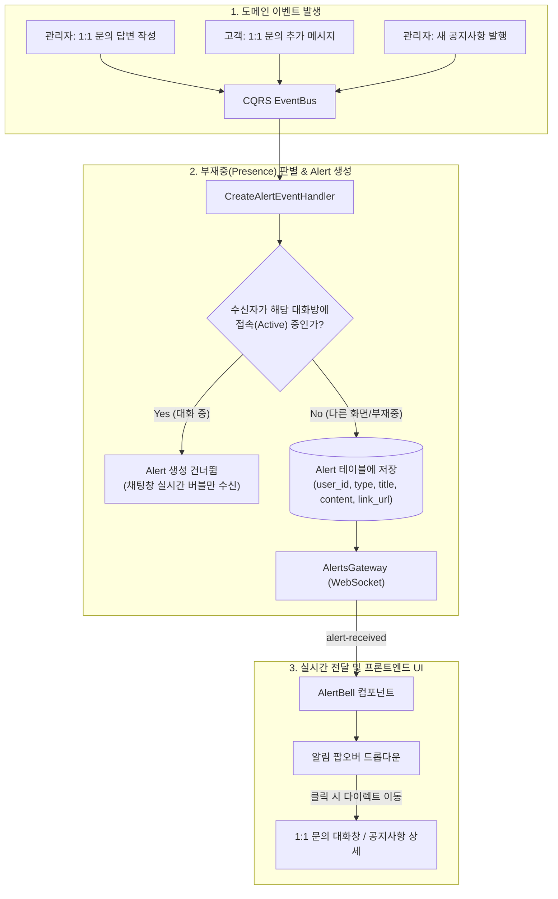

# 통합 Alert(인앱 알림) 시스템 구축 계획

공지사항(Notice)은 독립 도메인으로 유지하고, 신규 **`Alert`** 엔티티 및 전용 모듈을 구축하여 1:1 문의 답변, 신규 메시지, 공지사항 등록 등의 인앱 실시간 알림 시스템을 재구성합니다.
또한 대화 중 도배를 방지하기 위해 **"대화창 부재중(다른 화면/오프라인)일 때만 인앱 알림 발송"** 정책을 적용합니다.

---

## 🏛️ 시스템 아키텍처 및 흐름



---

## 📋 핵심 알림 정책 (부재중 판별)

1. **실시간 대화 중 (In-Room)**:
   * 수신자가 이미 해당 1:1 문의 대화창을 켜놓고 실시간 대화 중인 경우:
     * 채팅창 안에서 말풍선만 바로 갱신되고, **상단 종(🔔) 알림 및 토스트 팝업은 울리지 않습니다** (시야 방해 및 도배 방지).
2. **부재중 / 다른 메뉴 이용 중 (Out-of-Room / Offline)**:
   * 수신자가 대화방을 닫았거나, 다른 페이지를 보고 있거나, 로그아웃 상태인 경우:
     * `Alert` 테이블에 알림 레코드가 생성되고, **상단 종 아이콘에 빨간색 뱃지(+1)**가 실시간으로 표시됩니다.
     * 클릭 시 해당 1:1 문의 대화창으로 즉시 이동하여 대화창이 열립니다.

---

## Proposed Changes

### 1. 백엔드 데이터 모델 및 마이그레이션 (`nest-starter-kit`)

#### [NEW] [`alert.entity.ts`](file:///Users/server/Documents/GitHub/web-framework-app/template/nest-starter-kit/src/entities/alerts/alert.entity.ts)
* `Alert` 엔티티 정의:
  ```typescript
  export enum AlertType {
    INQUIRY_REPLY = 'inquiry_reply',       // 관리자 답변 도착 (고객 수신)
    INQUIRY_MESSAGE = 'inquiry_message',   // 고객 추가 메시지 도착 (담당 관리자 수신)
    NOTICE = 'notice',                     // 신규 공지사항 등록 (전체 사용자 수신)
    SYSTEM = 'system',                     // 시스템 알림
  }
  ```
* 필드: `id`, `user` (수신자 `Rel<User>`), `type`, `title`, `content`, `linkUrl`, `isRead`, `readAt`, `createdAt`, `updatedAt`, `deletedAt`

#### [NEW] 마이그레이션 파일 (`Migration20260818220000.ts`)
* `alert` 테이블 생성 및 인덱스(`user_id`, `is_read`, `created_at`) 구성

---

### 2. 백엔드 `Alerts` 모듈 (`nest-starter-kit`)

#### [NEW] `src/modules/alerts/`
* **DTO**:
  * `AlertItemDto`: `id`, `type`, `title`, `content`, `linkUrl`, `isRead`, `readAt`, `createdAt`
  * `AlertFeedResponseDto`: `items: AlertItemDto[]`, `unreadCount: number`, `total: number`
* **Queries & Handlers**:
  * `GetMyAlertsQuery` / `GetMyAlertsHandler`: 현재 로그인한 사용자의 최신 알림 목록 및 `unreadCount` 조회
* **Commands & Handlers**:
  * `CreateAlertCommand` / `CreateAlertHandler`: 알림 레코드 DB 생성 + `AlertsGateway` 실시간 소켓 브로드캐스트
  * `MarkAlertReadCommand` / `MarkAlertReadHandler`: 특정 알림 읽음 처리
  * `MarkAllAlertsReadCommand` / `MarkAllAlertsReadHandler`: 전체 알림 일괄 읽음 처리
  * `DeleteAlertCommand` / `DeleteAlertHandler`: 알림 삭제
* **Controller (`alerts.controller.ts`)**:
  * `GET /api/v1/alerts`: 내 알림 목록 및 읽지 않은 개수
  * `PATCH /api/v1/alerts/:id/read`: 단일 알림 읽음 처리
  * `PATCH /api/v1/alerts/read-all`: 전체 알림 일괄 읽음 처리
  * `DELETE /api/v1/alerts/:id`: 알림 삭제
* **Gateway (`alerts.gateway.ts`)**:
  * `/alerts` 네임스페이스를 통해 사용자별 룸(`user:{userId}`)으로 실시간 `alert-received` 전송
  * 특정 대화방 접속 상태(`inquiry-room:{inquiryId}`) 확인 헬퍼 제공

---

### 3. 이벤트 연동 (도메인 이벤트 $\rightarrow$ 부재중 판별 $\rightarrow$ Alert 자동 생성)

#### [MODIFY] [`create-inquiry-message.handler.ts`](file:///Users/server/Documents/GitHub/web-framework-app/template/nest-starter-kit/src/modules/inquiries/handlers/create-inquiry-message.handler.ts)
* **관리자가 답변 작성 시**:
  * 고객이 현재 해당 대화방 소켓 룸에 접속 중인지 확인
  * 접속 중이 아니면 $\rightarrow$ 고객 대상 `INQUIRY_REPLY` 알림 생성 (`linkUrl: /inquiries?inquiryId={id}`)
* **고객이 추가 메시지 작성 시**:
  * 담당 관리자(`inquiry.assignee`)가 현재 해당 대화방 소켓 룸에 접속 중인지 확인
  * 접속 중이 아니면 $\rightarrow$ 담당 관리자 대상 `INQUIRY_MESSAGE` 알림 생성 (`linkUrl: /inquiry-management?inquiryId={id}`)

#### [MODIFY] [`create-notice.handler.ts`](file:///Users/server/Documents/GitHub/web-framework-app/template/nest-starter-kit/src/modules/notices/handlers/create-notice.handler.ts)
* 공지사항 등록 시 $\rightarrow$ 전체 활성 사용자 대상 `NOTICE` 알림 생성 (`linkUrl: /announcements`)

---

### 4. 프론트엔드 통합 Alert 벨 (`react-starter-kit`)

#### [NEW] [`alert-bell.tsx`](file:///Users/server/Documents/GitHub/web-framework-app/template/react-starter-kit/src/components/app/alert-bell.tsx) (기존 `notice-bell.tsx` 교체)
* 상단 헤더의 종 모양 아이콘에서 **통합 `AlertBell`** 구동:
  1. **실시간 뱃지 카운트**: 읽지 않은 알림 개수 실시간 표시 (소켓 `alert-received` 수신 시 즉시 +1)
  2. **알림 목록 드롭다운**:
     * 1:1 문의 답변 알림 클릭 시 $\rightarrow$ 즉시 해당 1:1 문의 대화창 오픈
     * 공지사항 알림 클릭 시 $\rightarrow$ 공지사항 페이지(`/announcements`) 이동
  3. **"모두 읽음 처리"** 버튼
* 다국어 번역 키 추가 (`ko/alerts.json`, `en/alerts.json`)

---

## Verification Plan

### Automated Tests & Lint
- `pnpm --filter react-starter-kit gen:api`: OpenAPI 스펙 기반 Orval 클라이언트 코드 및 타입 자동 생성
- `pnpm typecheck`: 모노레포 전체 타입체크
- `pnpm lint`: 모노레포 전체 ESLint 규칙 검사

### Manual Verification
1. **대화 중 알림 억제 검증**:
   * 고객과 관리자가 같은 1:1 대화창을 열고 대화할 때는 상단 종 뱃지가 울리지 않는지 확인
2. **부재중 알림 검증**:
   * 고객이 대화창을 닫고 메인 화면에 있을 때 관리자가 답변을 달면 종 아이콘에 뱃지(+1)가 뜨고, 클릭 시 해당 대화창이 열리는지 확인
3. **읽음 처리 검증**:
   * 개별 알림 클릭 및 "모두 읽음" 클릭 시 뱃지 카운트가 즉시 제거되는지 확인
